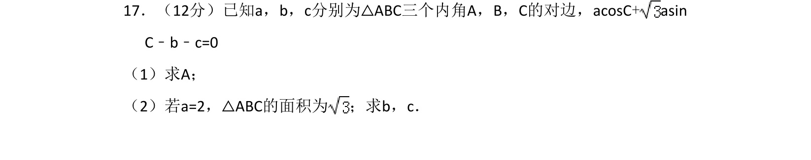
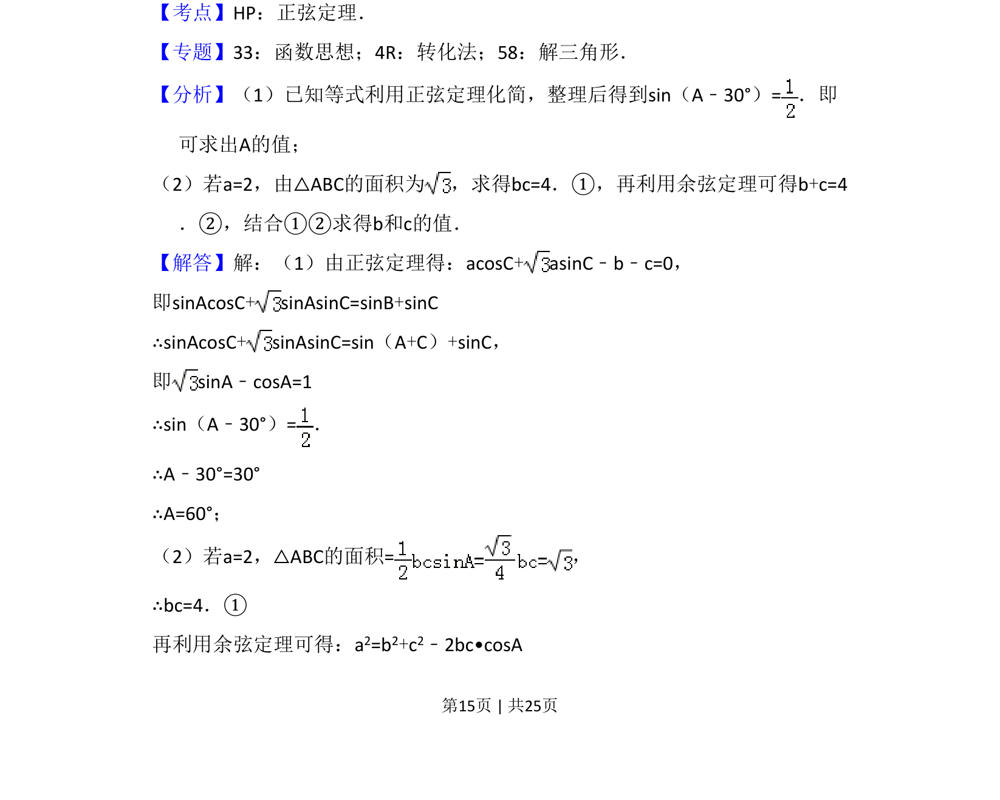

## 题面

## 摘要

利用正弦定理和三角恒等变换求三角形内角A，结合余弦定理与面积公式求边长b,c。

## 关联考点

- [[126-定理|正弦定理]]
- [[126-定理|余弦定理]]
- [[272-三角恒等变换|三角恒等变换]]
- [[062-多边形面积|三角形面积]]

## 答案与解析

> 📄 原 PDF 第 15 页：`素材/真题/吉林/2008-2024·（吉林）数学高考真题/2012年高考数学试卷（理）（新课标）（解析卷）.pdf`
