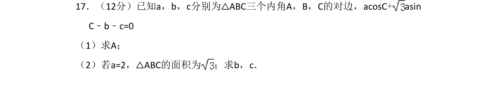
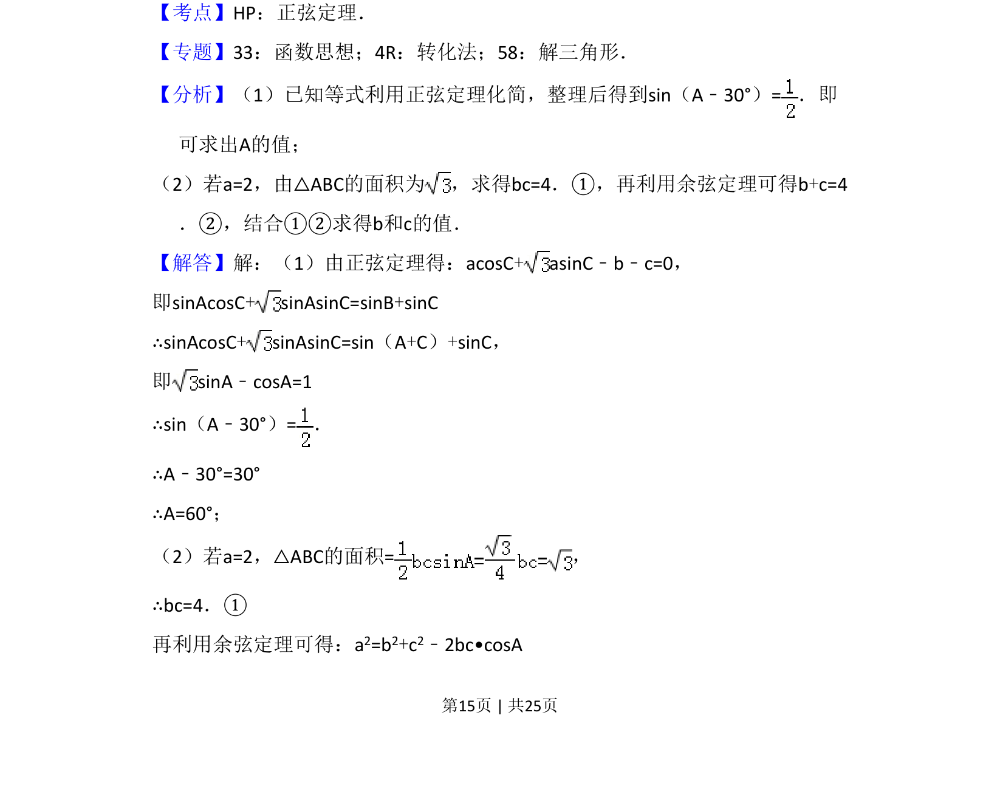
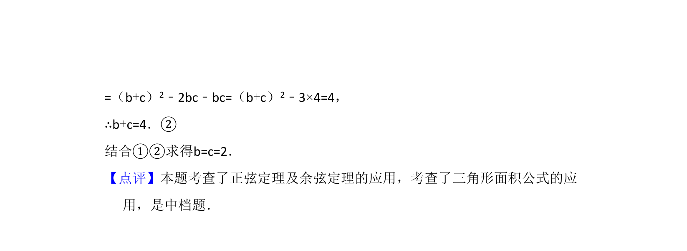

## 题面

## 摘要

利用正弦定理和三角恒等变换求三角形内角A，结合余弦定理与面积公式求边长b,c。

## 关联考点

- [[126-定理|正弦定理]]
- [[126-定理|余弦定理]]
- [[272-三角恒等变换|三角恒等变换]]
- [[062-多边形面积|三角形面积]]

## 答案与解析

> 📄 原 PDF 第 15 页：`素材/真题/吉林/2008-2024·（吉林）数学高考真题/2012年高考数学试卷（理）（新课标）（解析卷）.pdf`

<!-- 题干文本-start -->
## 题干文本
17．（12分）已知a，b，c分别为△ABC三个内角A，B，C的对边，acosC+asin
C﹣b﹣c=0
（1）求A；
（2）若a=2，△ABC的面积为 ；求b，c．
<!-- 题干文本-end -->

<!-- 解析文本-start -->
## 解析文本
【考点】HP：正弦定理．菁优网版权所有
【专题】33：函数思想；4R：转化法；58：解三角形．
【分析】（1）已知等式利用正弦定理化简，整理后得到sin（A﹣30°）=．即
可求出A的值；
（2）若a=2，由△ABC的面积为 ，求得bc=4．①，再利用余弦定理可得b+c=4
．②，结合①②求得b和c的值．
【解答】解：（1）由正弦定理得：acosC+asinC﹣b﹣c=0，
即sinAcosC+sinAsinC=sinB+sinC
∴sinAcosC+sinAsinC=sin（A+C）+sinC，
即sinA﹣cosA=1
∴sin（A﹣30°）=．
∴A﹣30°=30°
∴A=60°；
（2）若a=2，△ABC的面积=，
∴bc=4．①
再利用余弦定理可得：a2=b2+c2﹣2bc•cosA
<!-- 解析文本-end -->
