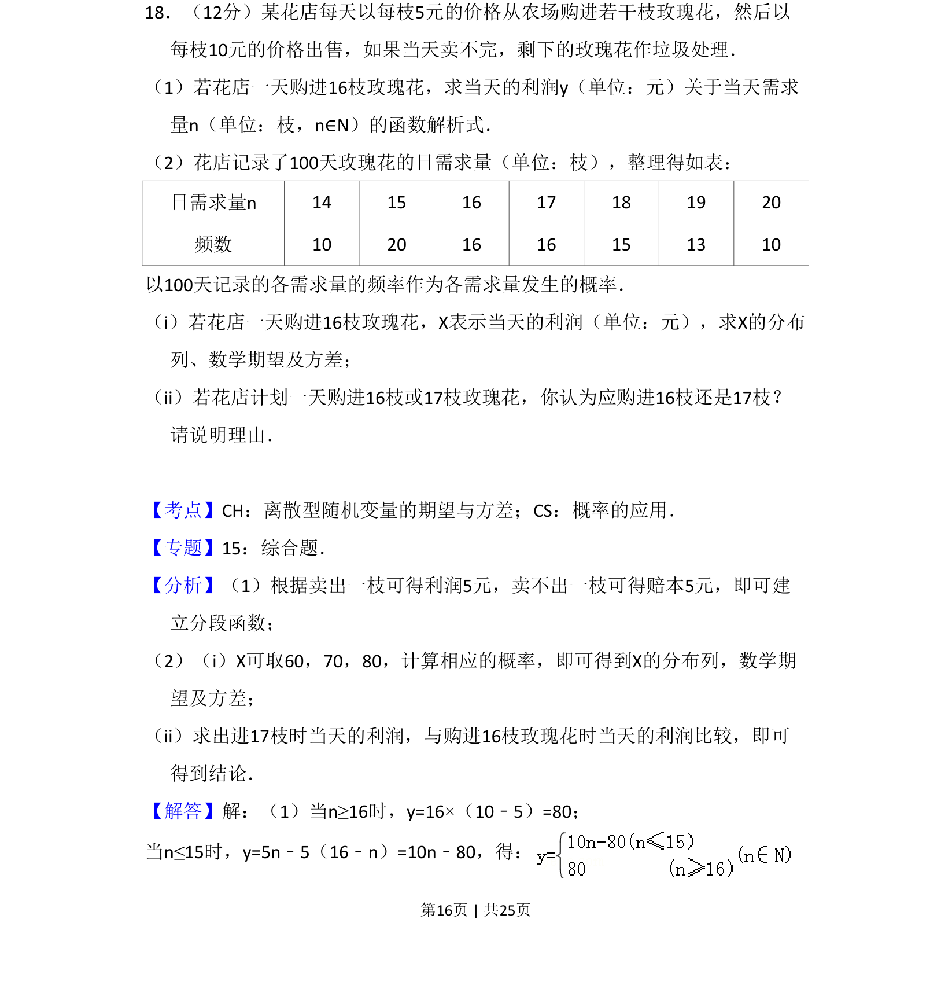
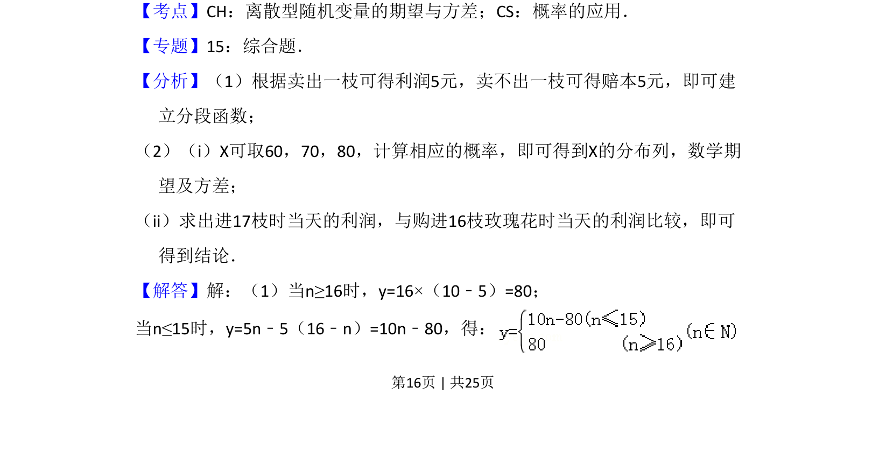
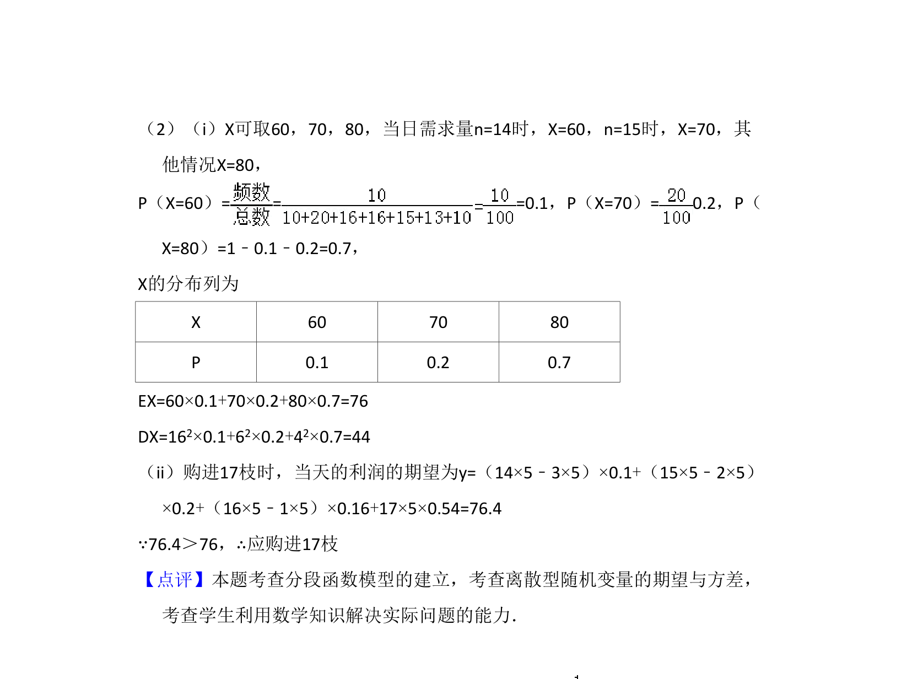

## 题面

## 摘要

以花店玫瑰花销售为背景，考查分段函数模型及离散型随机变量的分布列、期望与方差，并利用期望进行决策。

## 关联考点

- [[290-分段函数|分段函数]]
- [[499-离散型随机变量|离散型随机变量]]
- [[501-离散型随机变量期望|数学期望]]
- [[198-方差|方差]]

## 答案与解析

> 📄 原 PDF 第 16 页：`素材/真题/吉林/2008-2024·（吉林）数学高考真题/2012年高考数学试卷（理）（新课标）（解析卷）.pdf`
