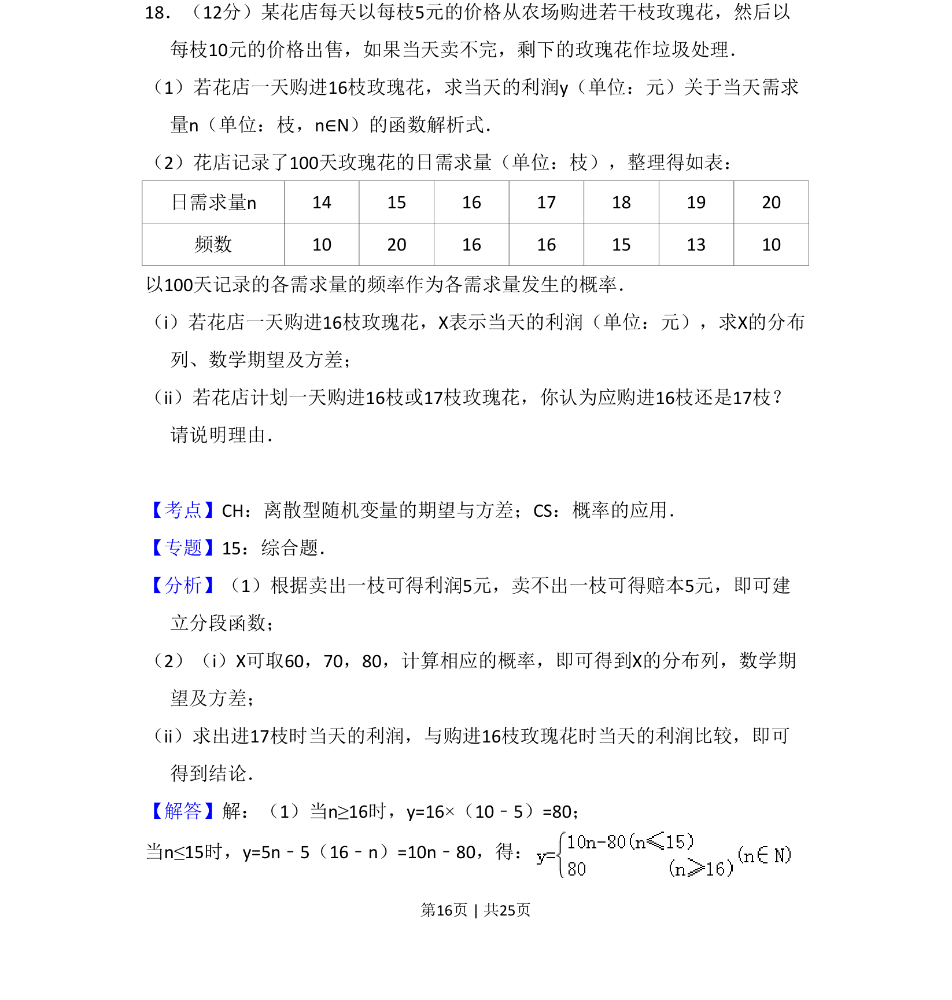
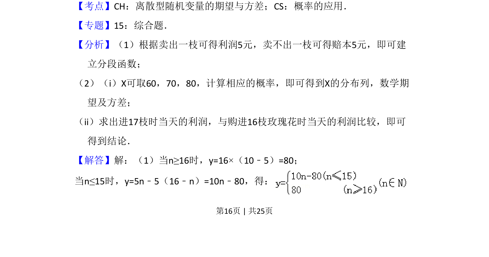
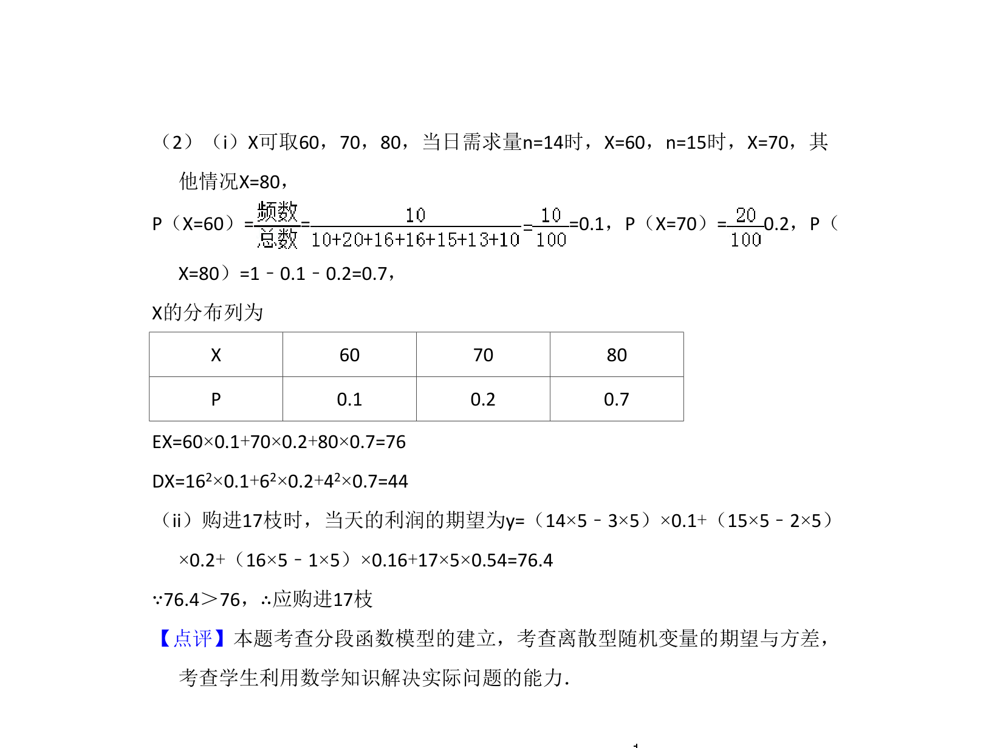

## 题面

## 摘要

以花店玫瑰花销售为背景，考查分段函数模型及离散型随机变量的分布列、期望与方差，并利用期望进行决策。

## 关联考点

- [[290-分段函数|分段函数]]
- [[499-离散型随机变量|离散型随机变量]]
- [[501-离散型随机变量期望|数学期望]]
- [[198-方差|方差]]

## 答案与解析

> 📄 原 PDF 第 16 页：`素材/真题/吉林/2008-2024·（吉林）数学高考真题/2012年高考数学试卷（理）（新课标）（解析卷）.pdf`

<!-- 题干文本-start -->
## 题干文本
18．（12分）某花店每天以每枝5元的价格从农场购进若干枝玫瑰花，然后以
每枝10元的价格出售，如果当天卖不完，剩下的玫瑰花作垃圾处理．
（1）若花店一天购进16枝玫瑰花，求当天的利润y（单位：元）关于当天需求
量n（单位：枝，n∈N）的函数解析式．
（2）花店记录了100天玫瑰花的日需求量（单位：枝），整理得如表：
日需求量n 14 15 16 17 18 19 20
频数 10 20 16 16 15 13 10
以100天记录的各需求量的频率作为各需求量发生的概率．
（i）若花店一天购进16枝玫瑰花，X表示当天的利润（单位：元），求X的分布
列、数学期望及方差；
（ii）若花店计划一天购进16枝或17枝玫瑰花，你认为应购进16枝还是17枝？
请说明理由．
<!-- 题干文本-end -->

<!-- 解析文本-start -->
## 解析文本
【考点】CH：离散型随机变量的期望与方差；CS：概率的应用．菁优网版权所有
【专题】15：综合题．
【分析】（1）根据卖出一枝可得利润5元，卖不出一枝可得赔本5元，即可建
立分段函数；
（2）（i）X可取60，70，80，计算相应的概率，即可得到X的分布列，数学期
望及方差；
（ii）求出进17枝时当天的利润，与购进16枝玫瑰花时当天的利润比较，即可
得到结论．
【解答】解：（1）当n≥16时，y=16×（10﹣5）=80；
当n≤15时，y=5n﹣5（16﹣n）=10n﹣80，得：
<!-- 解析文本-end -->
