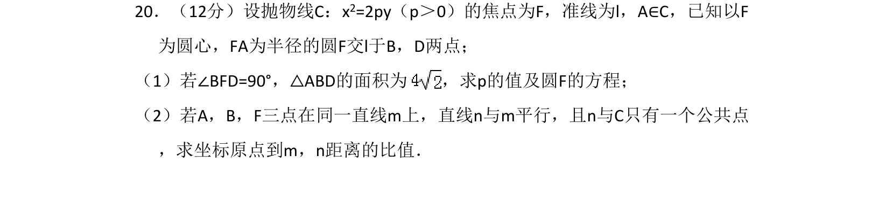
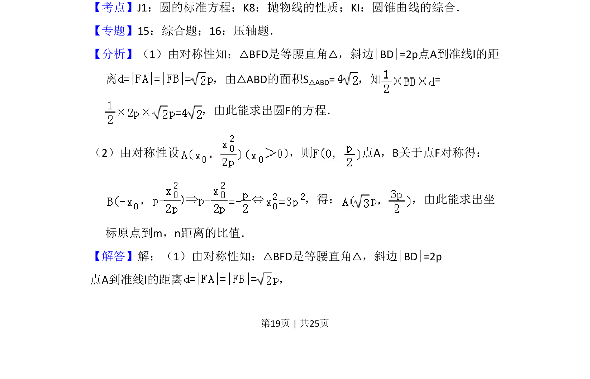
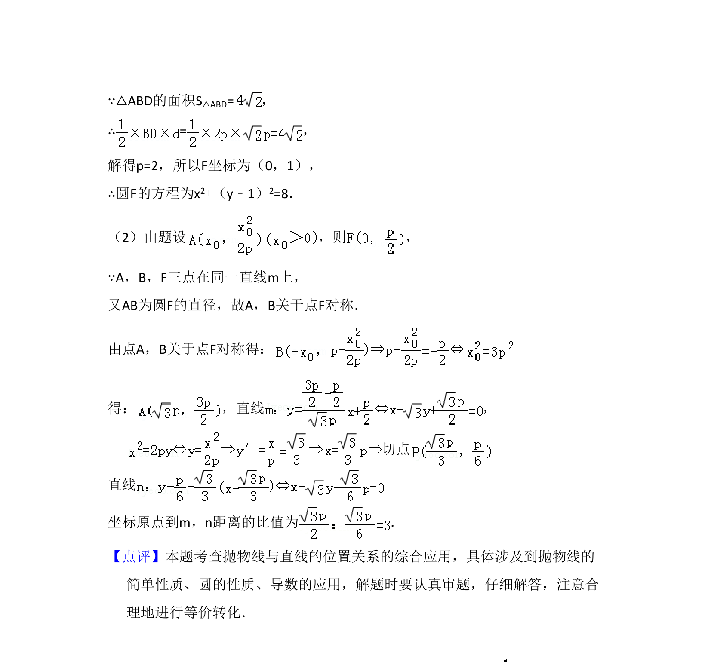

## 题面

## 摘要

抛物线几何性质结合圆方程，求解参数值及距离比。

## 关联考点

- [[373-圆的标准方程|圆的标准方程]]
- [[879-抛物线的性质|抛物线的性质]]
- [[785-圆锥曲线的综合|圆锥曲线的综合]]

## 答案与解析

> 📄 原 PDF 第 19 页：`素材/真题/吉林/2008-2024·（吉林）数学高考真题/2012年高考数学试卷（理）（新课标）（解析卷）.pdf`
