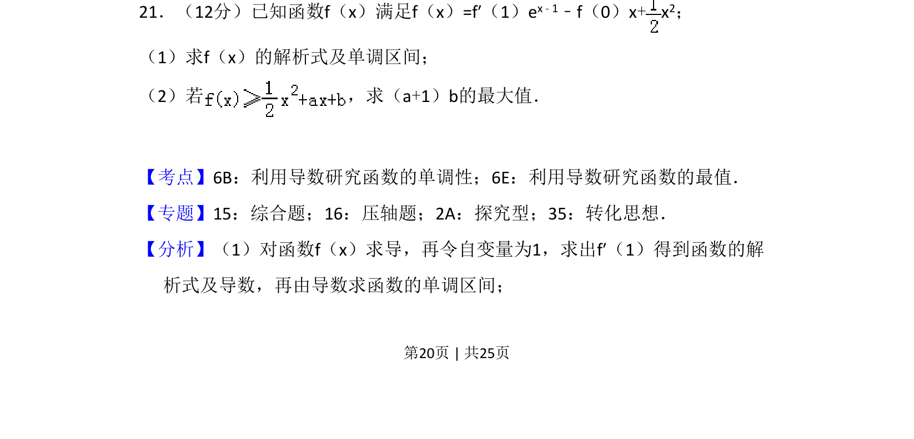

## 题面

## 摘要

通过导数求函数解析式与单调区间，并求含参表达式的最大值。

## 关联考点

- [[利用导数研究函数的单调性]]
- [[利用导数研究函数的最值]]
- [[导数的运算]]
- [[构造法]]

## 答案与解析

> 📄 原 PDF 第 20 页：`素材/真题/吉林/2008-2024·（吉林）数学高考真题/2012年高考数学试卷（理）（新课标）（解析卷）.pdf`
