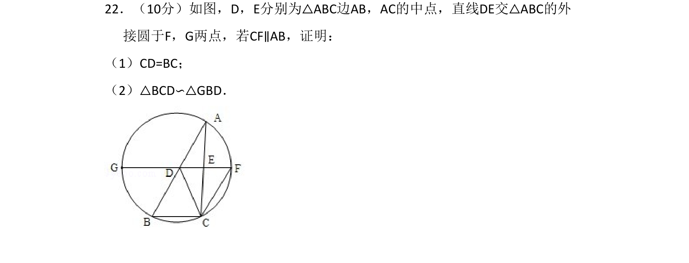
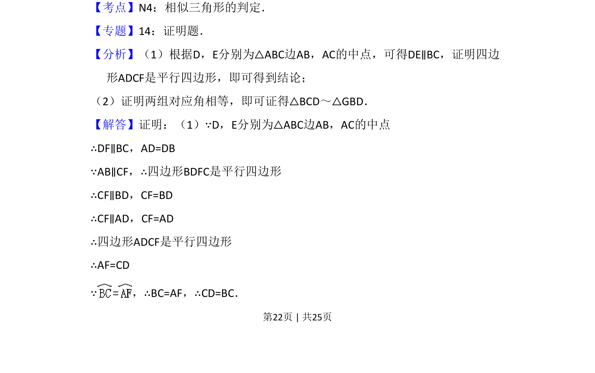
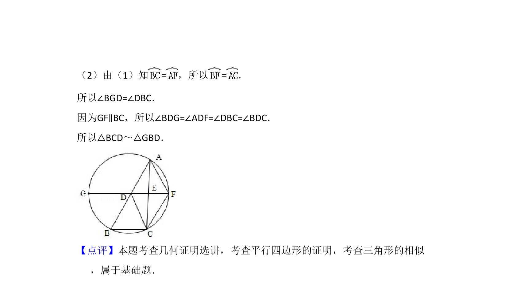

## 题面

## 摘要

利用三角形中位线和平行四边形证明线段相等，进而证明三角形相似。

## 关联考点

- [[1035-相似三角形的判定|相似三角形的判定]]
- [[617-三角形中位线定理|三角形中位线定理]]
- [[848-平行四边形的判定与性质|平行四边形的判定与性质]]

## 答案与解析

> 📄 原 PDF 第 22 页：`素材/真题/吉林/2008-2024·（吉林）数学高考真题/2012年高考数学试卷（理）（新课标）（解析卷）.pdf`

<!-- 题干文本-start -->
## 题干文本
22．（10分）如图，D，E分别为△ABC边AB，AC的中点，直线DE交△ABC的外
接圆于F，G两点，若CF∥AB，证明：
（1）CD=BC；
（2）△BCD∽△GBD．
<!-- 题干文本-end -->

<!-- 解析文本-start -->
## 解析文本
【考点】N4：相似三角形的判定．菁优网版权所有
【专题】14：证明题．
【分析】（1）根据D，E分别为△ABC边AB，AC的中点，可得DE∥BC，证明四边
形ADCF是平行四边形，即可得到结论；
（2）证明两组对应角相等，即可证得△BCD～△GBD．
【解答】证明：（1）∵D，E分别为△ABC边AB，AC的中点
∴DF∥BC，AD=DB
∵AB∥CF，∴四边形BDFC是平行四边形
∴CF∥BD，CF=BD
∴CF∥AD，CF=AD
∴四边形ADCF是平行四边形
∴AF=CD
∵，∴BC=AF，∴CD=BC．
<!-- 解析文本-end -->
