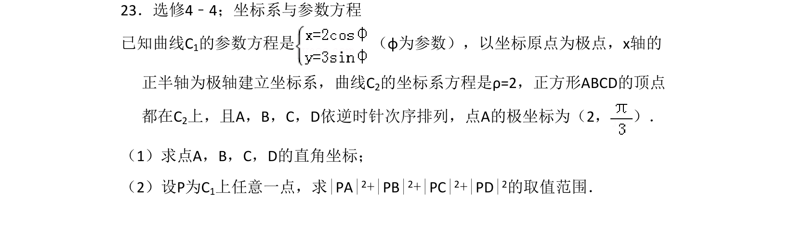
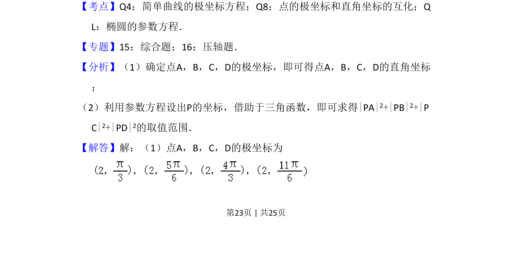
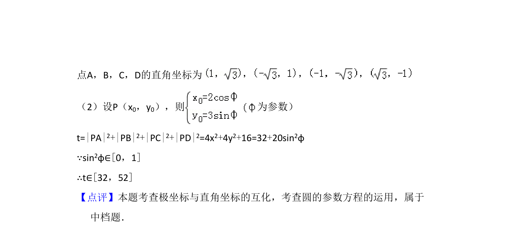

## 题面

## 摘要

考查极坐标与直角坐标互化，利用椭圆参数方程求距离平方和的取值范围。

## 关联考点

- [[922-极坐标方程|极坐标方程]]
- [[921-极坐标与直角坐标互化|极坐标与直角坐标互化]]
- [[565-椭圆的参数方程|椭圆的参数方程]]

## 答案与解析

> 📄 原 PDF 第 23 页：`素材/真题/吉林/2008-2024·（吉林）数学高考真题/2012年高考数学试卷（理）（新课标）（解析卷）.pdf`
