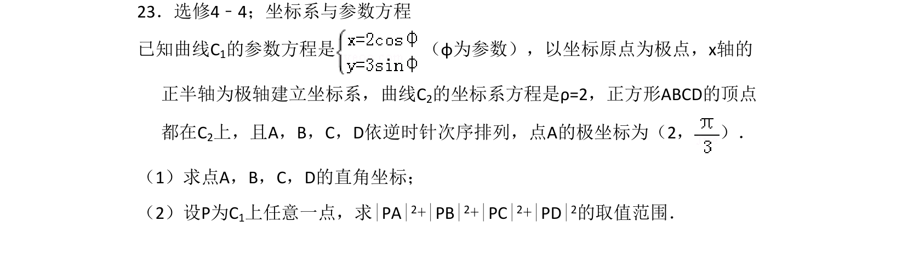
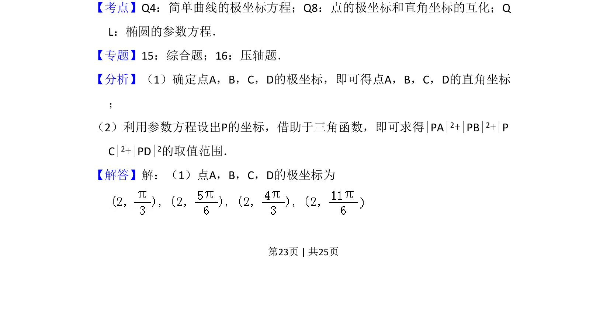
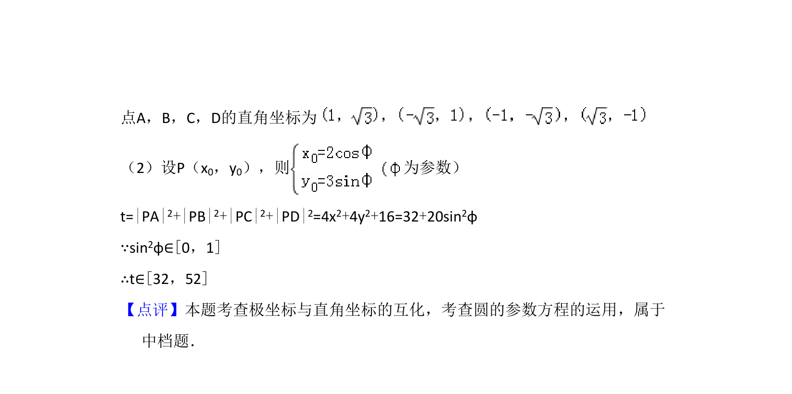

## 题面

## 摘要

考查极坐标与直角坐标互化，利用椭圆参数方程求距离平方和的取值范围。

## 关联考点

- [[921-极坐标方程|极坐标方程]]
- [[920-极坐标与直角坐标互化|极坐标与直角坐标互化]]
- [[565-椭圆的参数方程|椭圆的参数方程]]

## 答案与解析

> 📄 原 PDF 第 23 页：`素材/真题/吉林/2008-2024·（吉林）数学高考真题/2012年高考数学试卷（理）（新课标）（解析卷）.pdf`

<!-- 题干文本-start -->
## 题干文本
23．选修4﹣4；坐标系与参数方程
已知曲线C1的参数方程是 （φ为参数），以坐标原点为极点，x轴的
正半轴为极轴建立坐标系，曲线C2的坐标系方程是ρ=2，正方形ABCD的顶点
都在C2上，且A，B，C，D依逆时针次序排列，点A的极坐标为（2， ）．
（1）求点A，B，C，D的直角坐标；
（2）设P为C1上任意一点，求|PA|2+|PB|2+|PC|2+|PD|2的取值范围．
<!-- 题干文本-end -->

<!-- 解析文本-start -->
## 解析文本
【考点】Q4：简单曲线的极坐标方程；Q8：点的极坐标和直角坐标的互化；Q
L：椭圆的参数方程．菁优网版权所有
【专题】15：综合题；16：压轴题．
【分析】（1）确定点A，B，C，D的极坐标，即可得点A，B，C，D的直角坐标
；
（2）利用参数方程设出P的坐标，借助于三角函数，即可求得|PA|2+|PB|2+|P
C|2+|PD|2的取值范围．
【解答】解：（1）点A，B，C，D的极坐标为
<!-- 解析文本-end -->
