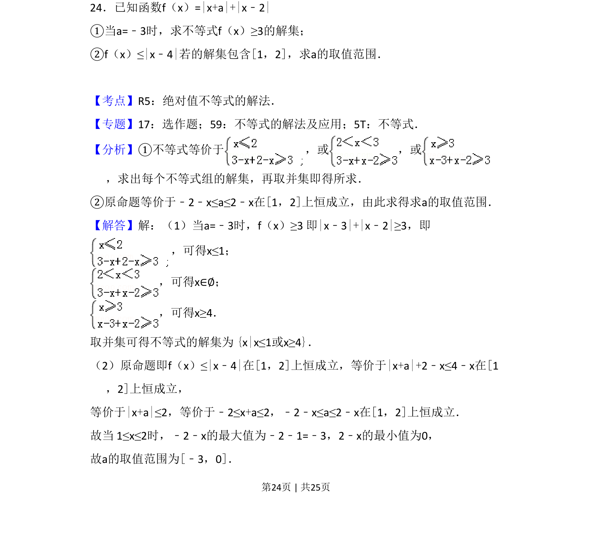
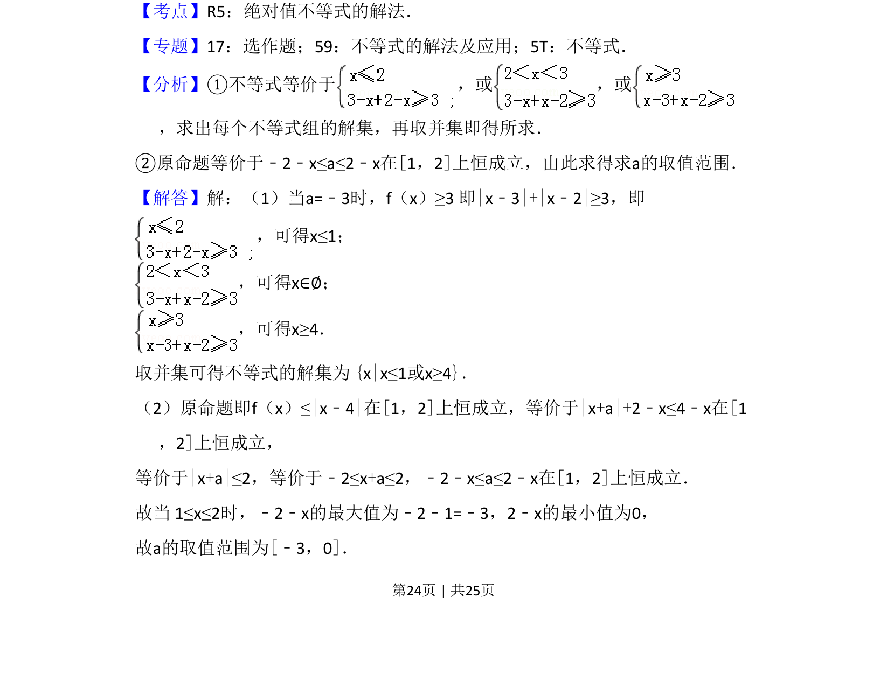

## 题面

## 摘要

考查含绝对值的不等式求解及在给定区间上恒成立求参数范围。

## 关联考点

- [[1093-绝对值不等式的解法|绝对值不等式解法]]
- [[450-恒成立问题|恒成立问题]]
- [[721-参数取值范围|参数取值范围]]

## 答案与解析

> 📄 原 PDF 第 24 页：`素材/真题/吉林/2008-2024·（吉林）数学高考真题/2012年高考数学试卷（理）（新课标）（解析卷）.pdf`

<!-- 题干文本-start -->
## 题干文本
24．已知函数f（x）=|x+a|+|x﹣2|
①当a=﹣3时，求不等式f（x）≥3的解集；
②f（x）≤|x﹣4|若的解集包含[1，2]，求a的取值范围．
<!-- 题干文本-end -->

<!-- 解析文本-start -->
## 解析文本
【考点】R5：绝对值不等式的解法．菁优网版权所有
【专题】17：选作题；59：不等式的解法及应用；5T：不等式．
【分析】①不等式等价于 ，或 ，或
，求出每个不等式组的解集，再取并集即得所求．
②原命题等价于﹣2﹣x≤a≤2﹣x在[1，2]上恒成立，由此求得求a的取值范围．
【解答】解：（1）当a=﹣3时，f（x）≥3 即|x﹣3|+|x﹣2|≥3，即
，可得x≤1；
，可得x∈∅；
，可得x≥4．
取并集可得不等式的解集为 {x|x≤1或x≥4}．
（2）原命题即f（x）≤|x﹣4|在[1，2]上恒成立，等价于|x+a|+2﹣x≤4﹣x在[1
，2]上恒成立，
等价于|x+a|≤2，等价于﹣2≤x+a≤2，﹣2﹣x≤a≤2﹣x在[1，2]上恒成立．
故当 1≤x≤2时，﹣2﹣x的最大值为﹣2﹣1=﹣3，2﹣x的最小值为0，
故a的取值范围为[﹣3，0]．
<!-- 解析文本-end -->
