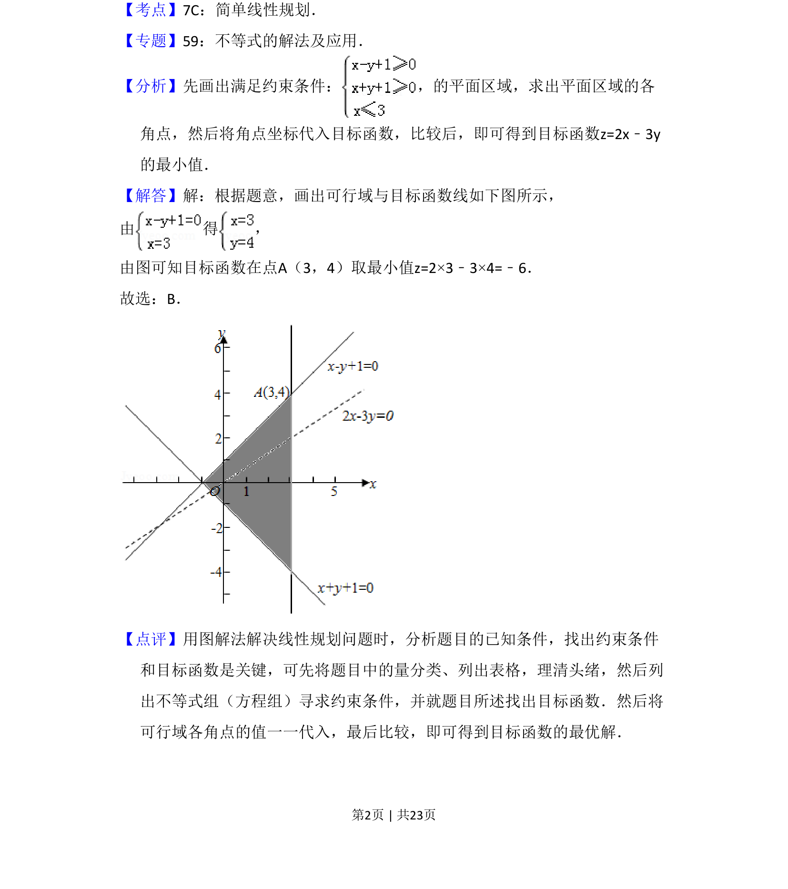

## 题面

## 摘要

考查线性规划，根据约束条件求目标函数的最小值。

## 关联考点

- [[1074-简单线性规划|简单线性规划]]
- [[1156-可行域|可行域]]
- [[1000-目标函数最值|目标函数最值]]

## 答案与解析

> 📄 原 PDF 第 2 页：`素材/真题/吉林/2008-2024·（吉林）数学高考真题/2013年高考数学试卷（文）（新课标Ⅱ）（解析卷）.pdf`
