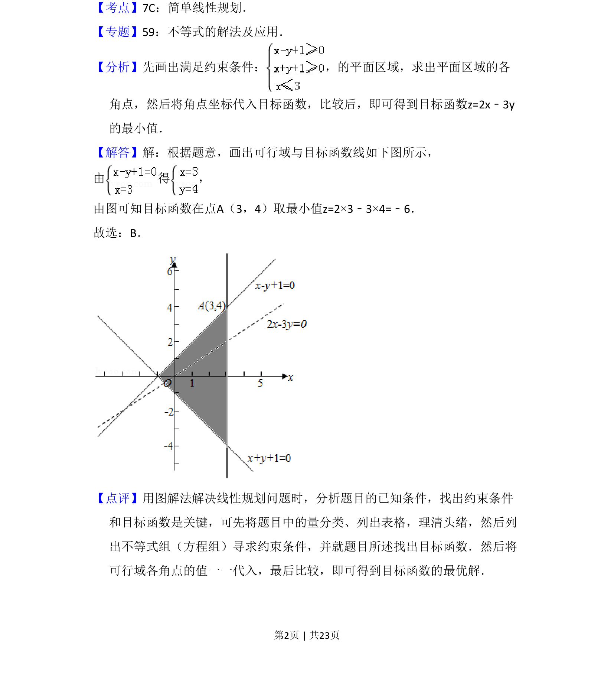

## 题面

## 摘要

考查线性规划，根据约束条件求目标函数的最小值。

## 关联考点

- [[1074-简单线性规划|简单线性规划]]
- [[1156-可行域|可行域]]
- [[1000-目标函数最值|目标函数最值]]

## 答案与解析

> 📄 原 PDF 第 2 页：`素材/真题/吉林/2008-2024·（吉林）数学高考真题/2013年高考数学试卷（文）（新课标Ⅱ）（解析卷）.pdf`

<!-- 题干文本-start -->
## 题干文本
3．（5分）设x，y满足约束条件 ，则z=2x﹣3y的最小值是（　　）
A．﹣7 B．﹣6 C．﹣5 D．﹣3
<!-- 题干文本-end -->

<!-- 解析文本-start -->
## 解析文本
【考点】7C：简单线性规划．菁优网版权所有
【专题】59：不等式的解法及应用．
【分析】先画出满足约束条件： ，的平面区域，求出平面区域的各
角点，然后将角点坐标代入目标函数，比较后，即可得到目标函数z=2x﹣3y
的最小值．
【解答】解：根据题意，画出可行域与目标函数线如下图所示，
由 得 ，
由图可知目标函数在点A（3，4）取最小值z=2×3﹣3×4=﹣6．
故选：B．
【点评】用图解法解决线性规划问题时，分析题目的已知条件，找出约束条件
和目标函数是关键，可先将题目中的量分类、列出表格，理清头绪，然后列
出不等式组（方程组）寻求约束条件，并就题目所述找出目标函数．然后将
可行域各角点的值一一代入，最后比较，即可得到目标函数的最优解．
<!-- 解析文本-end -->
