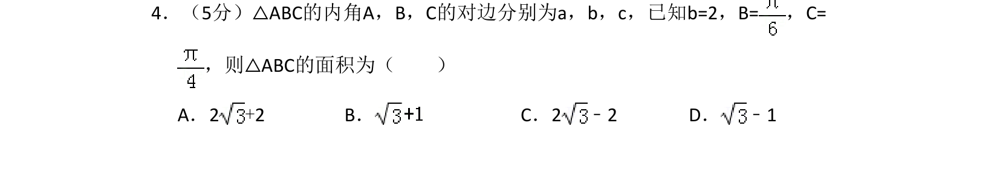
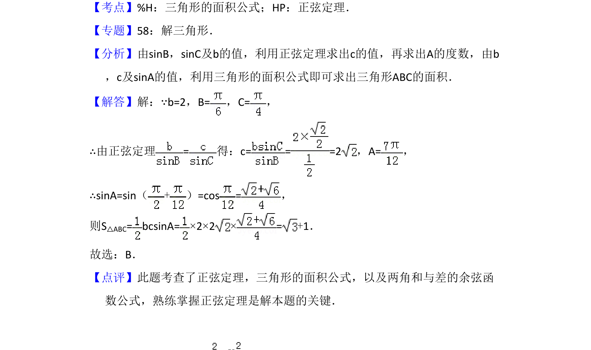

## 题面

## 摘要

利用正弦定理求边长，再用三角形面积公式计算面积。

## 关联考点

- [[126-定理|正弦定理]]
- [[619-三角形面积公式|三角形面积公式]]
- [[633-两角和的余弦公式|两角和的余弦公式]]

## 答案与解析

> 📄 原 PDF 第 3 页：`素材/真题/吉林/2008-2024·（吉林）数学高考真题/2013年高考数学试卷（文）（新课标Ⅱ）（解析卷）.pdf`
