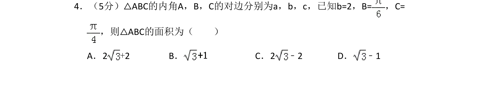
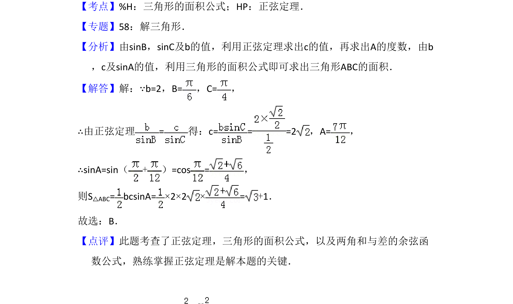

## 题面

## 摘要

利用正弦定理求边长，再用三角形面积公式计算面积。

## 关联考点

- [[126-定理|正弦定理]]
- [[619-三角形面积公式|三角形面积公式]]
- [[633-两角和的余弦公式|两角和的余弦公式]]

## 答案与解析

> 📄 原 PDF 第 3 页：`素材/真题/吉林/2008-2024·（吉林）数学高考真题/2013年高考数学试卷（文）（新课标Ⅱ）（解析卷）.pdf`

<!-- 题干文本-start -->
## 题干文本
4．（5分）△ABC的内角A，B，C的对边分别为a，b，c，已知b=2，B=，C=
，则△ABC的面积为（　　）
A．2+2 B．C．2﹣2 D． ﹣1
<!-- 题干文本-end -->

<!-- 解析文本-start -->
## 解析文本
【考点】%H：三角形的面积公式；HP：正弦定理．菁优网版权所有
【专题】58：解三角形．
【分析】由sinB，sinC及b的值，利用正弦定理求出c的值，再求出A的度数，由b
，c及sinA的值，利用三角形的面积公式即可求出三角形ABC的面积．
【解答】解：∵b=2，B=，C=，
∴由正弦定理=得：c= = =2，A=，
∴sinA=sin（+）=cos =，
则S△ABC= bcsinA=×2×2×=+1．
故选：B．
【点评】此题考查了正弦定理，三角形的面积公式，以及两角和与差的余弦函
数公式，熟练掌握正弦定理是解本题的关键．
<!-- 解析文本-end -->
