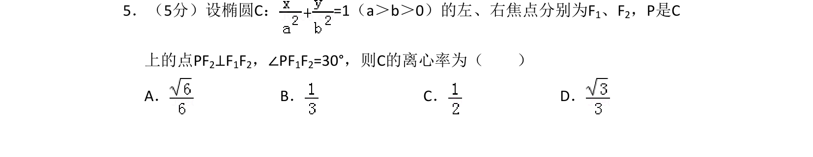
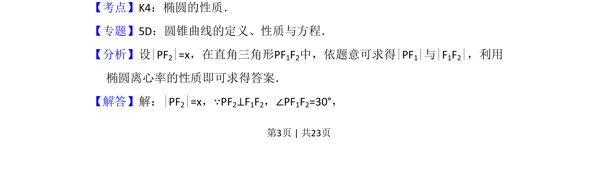
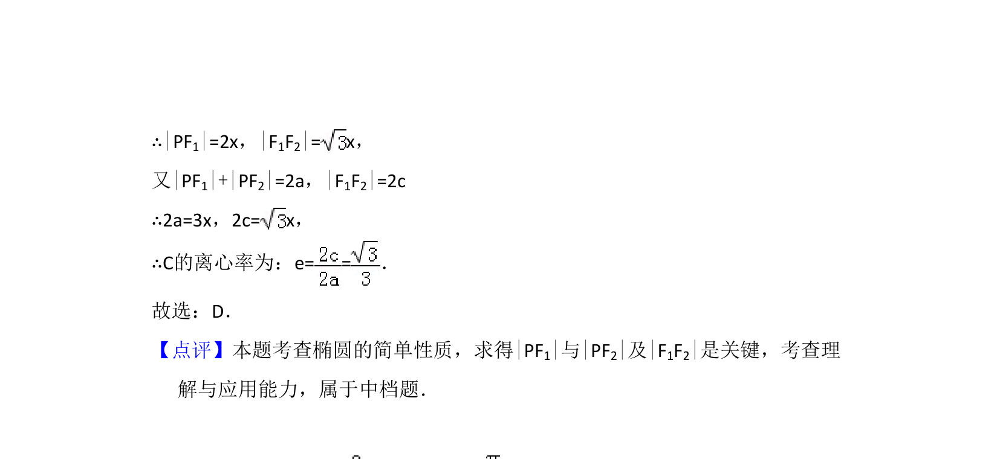

## 题面

## 摘要

求椭圆离心率，利用焦点三角形中垂直与角度关系计算。

## 关联考点

- [[388-椭圆几何性质|椭圆性质]]
- [[391-椭圆离心率|离心率]]
- [[571-焦点三角形|焦点三角形]]

## 答案与解析

> 📄 原 PDF 第 3 页：`素材/真题/吉林/2008-2024·（吉林）数学高考真题/2013年高考数学试卷（文）（新课标Ⅱ）（解析卷）.pdf`

<!-- 题干文本-start -->
## 题干文本
5．（5分）设椭圆C：=1（a＞b＞0）的左、右焦点分别为F 1、F2，P是C
上的点PF2⊥F1F2，∠PF1F2=30°，则C的离心率为（　　）
A．B．C．D．
<!-- 题干文本-end -->

<!-- 解析文本-start -->
## 解析文本
【考点】K4：椭圆的性质．菁优网版权所有
【专题】5D：圆锥曲线的定义、性质与方程．
【分析】设|PF2|=x，在直角三角形PF1F2中，依题意可求得|PF1|与|F1F2|，利用
椭圆离心率的性质即可求得答案．
【解答】解：|PF2|=x，∵PF2⊥F1F2，∠PF1F2=30°，
<!-- 解析文本-end -->
