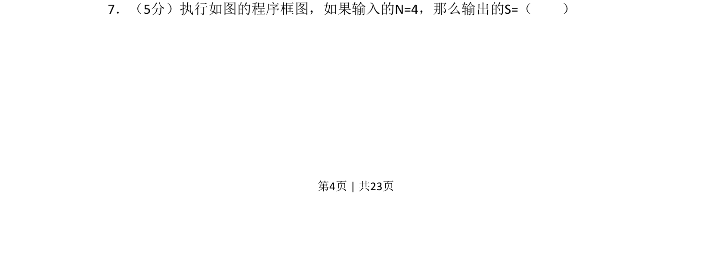
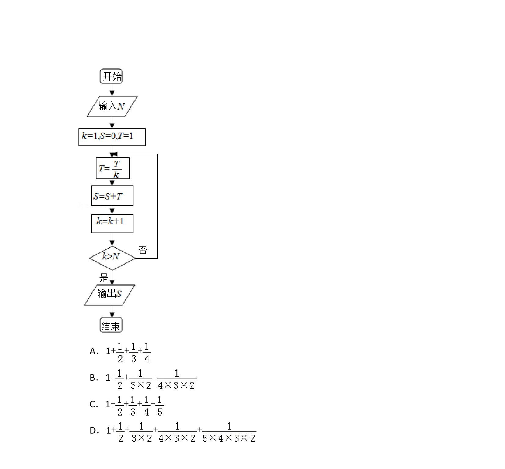
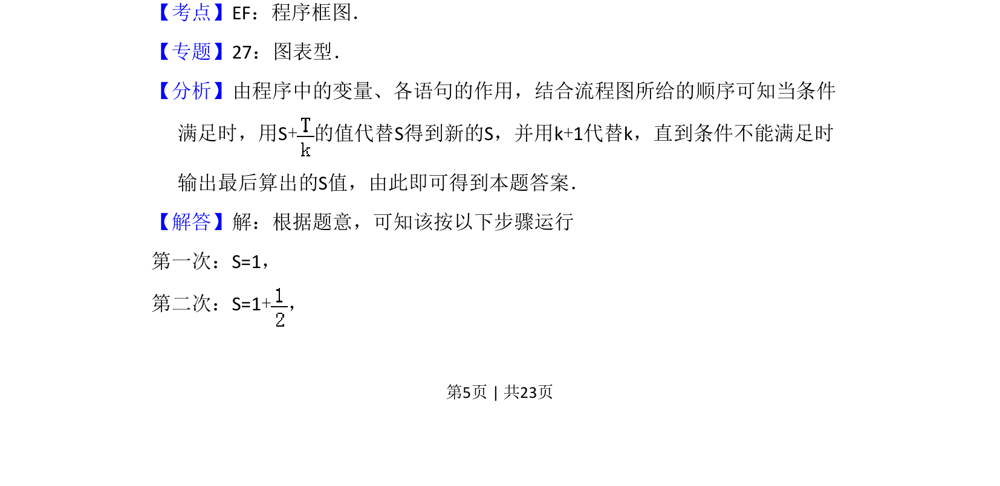
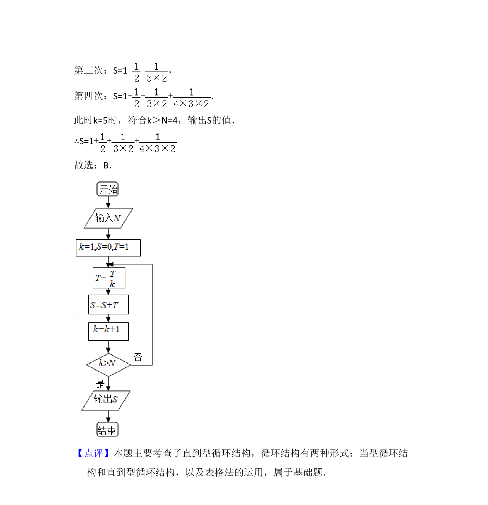

## 题面

## 摘要

该题考查程序框图的执行与循环结构，给出N=4时计算累加和S的值。

## 关联考点

- [[1042-程序框图|程序框图]]
- [[870-循环结构|循环结构]]
- [[1081-累加求和|数列求和]]

## 答案与解析

> 📄 原 PDF 第 4 页：`素材/真题/吉林/2008-2024·（吉林）数学高考真题/2013年高考数学试卷（文）（新课标Ⅱ）（解析卷）.pdf`
