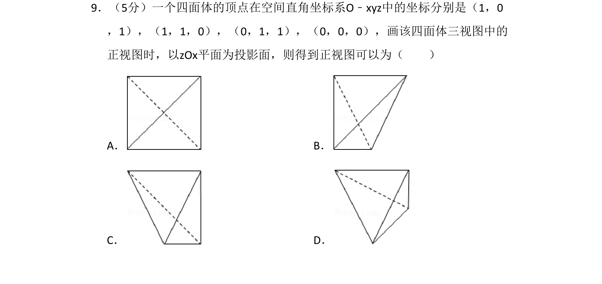
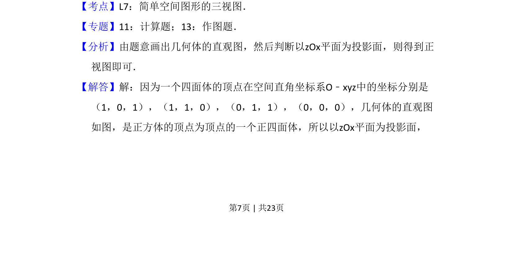
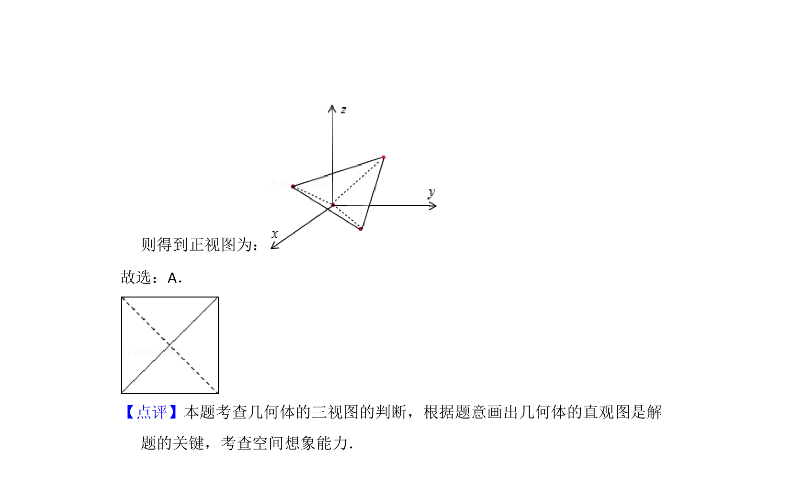

## 题面

## 摘要

由空间直角坐标系中的点坐标判断四面体形状，并画出在zOx平面上的正视图。

## 关联考点

- [[399-空间向量坐标表示|空间直角坐标系]]
- [[235-三视图|三视图]]
- [[235-三视图|正视图]]

## 答案与解析

> 📄 原 PDF 第 7 页：`素材/真题/吉林/2008-2024·（吉林）数学高考真题/2013年高考数学试卷（文）（新课标Ⅱ）（解析卷）.pdf`
