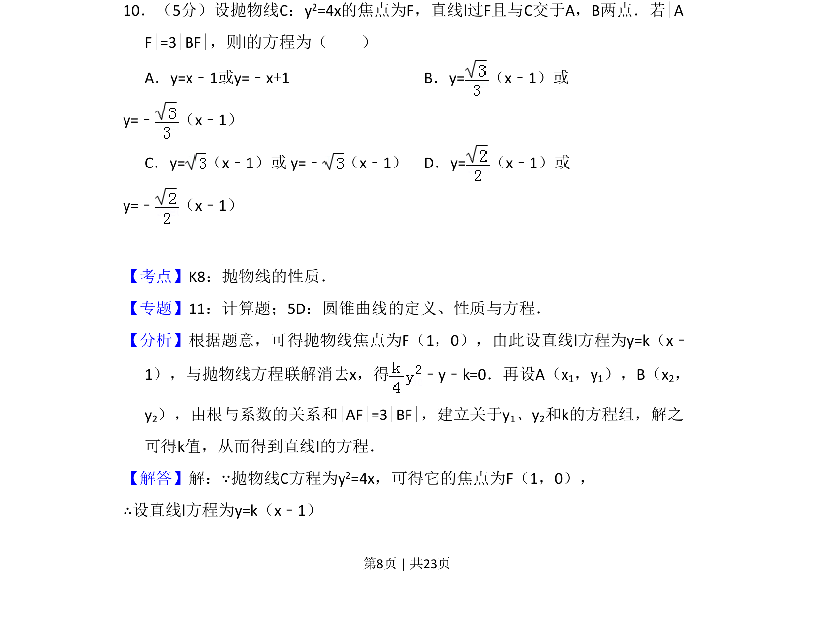
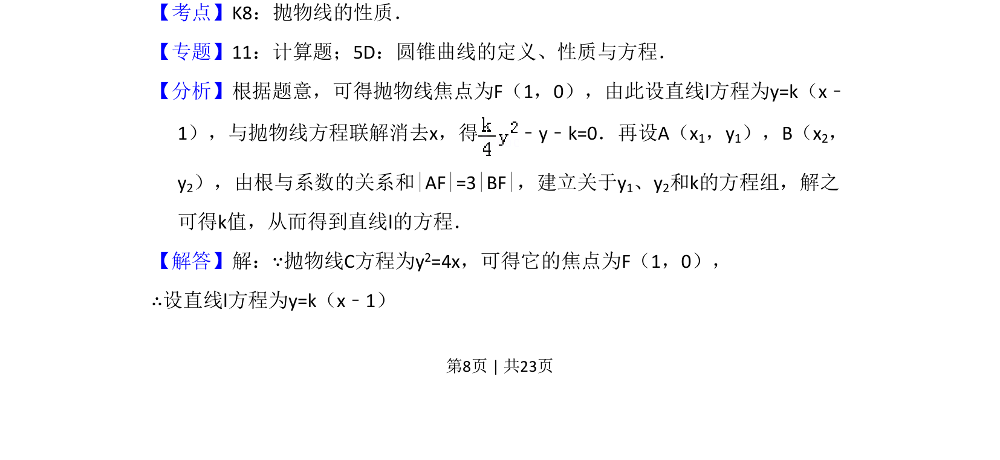
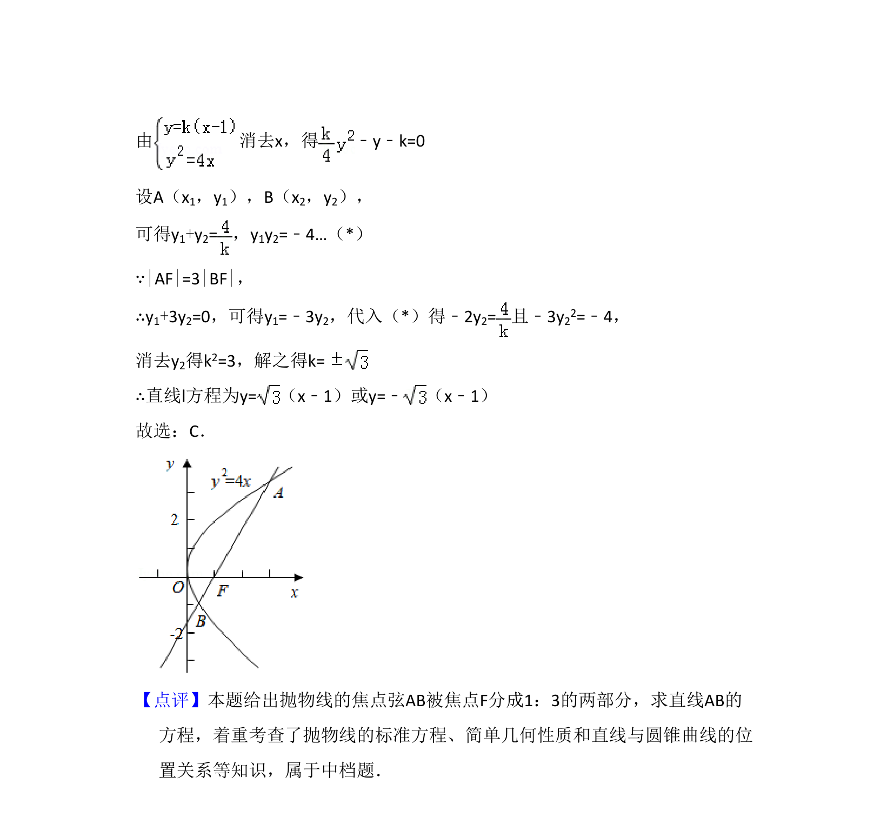

## 题面

## 摘要

本题考查抛物线焦点弦性质，通过直线与抛物线联立，利用弦长比例关系求解直线方程。

## 关联考点

- [[879-抛物线的性质|抛物线的性质]]
- [[1005-直线与圆锥曲线位置关系|直线与圆锥曲线位置关系]]
- [[234-韦达定理-初中|韦达定理]]
- [[868-弦长关系|弦长关系]]

## 答案与解析

> 📄 原 PDF 第 8 页：`素材/真题/吉林/2008-2024·（吉林）数学高考真题/2013年高考数学试卷（文）（新课标Ⅱ）（解析卷）.pdf`
