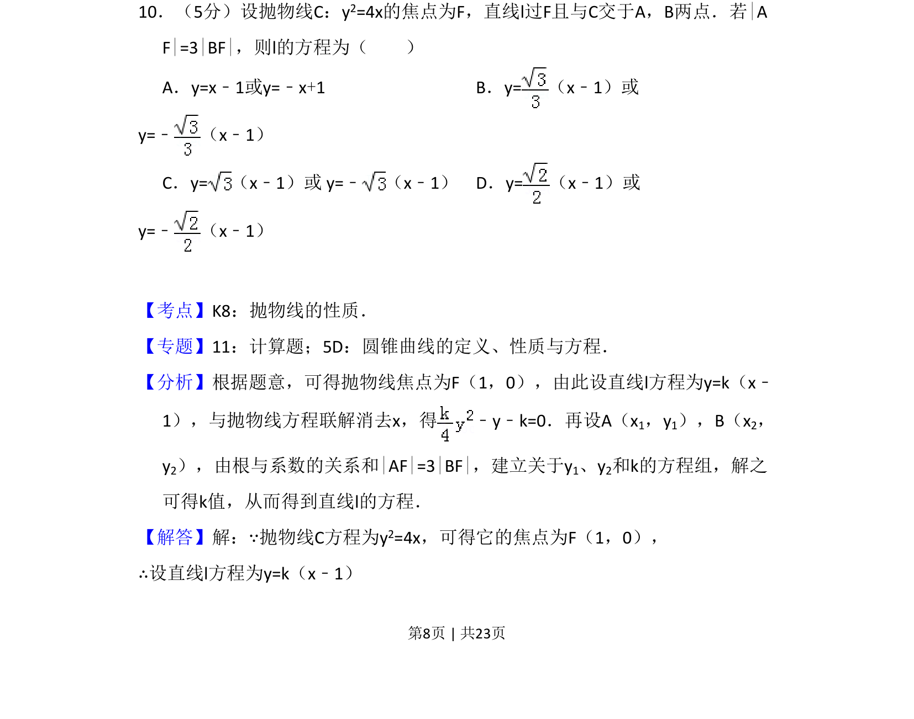
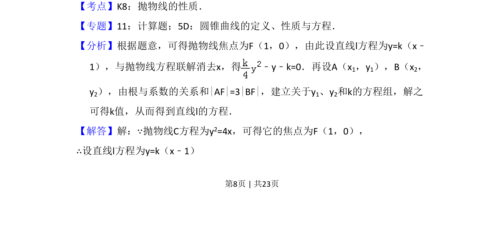
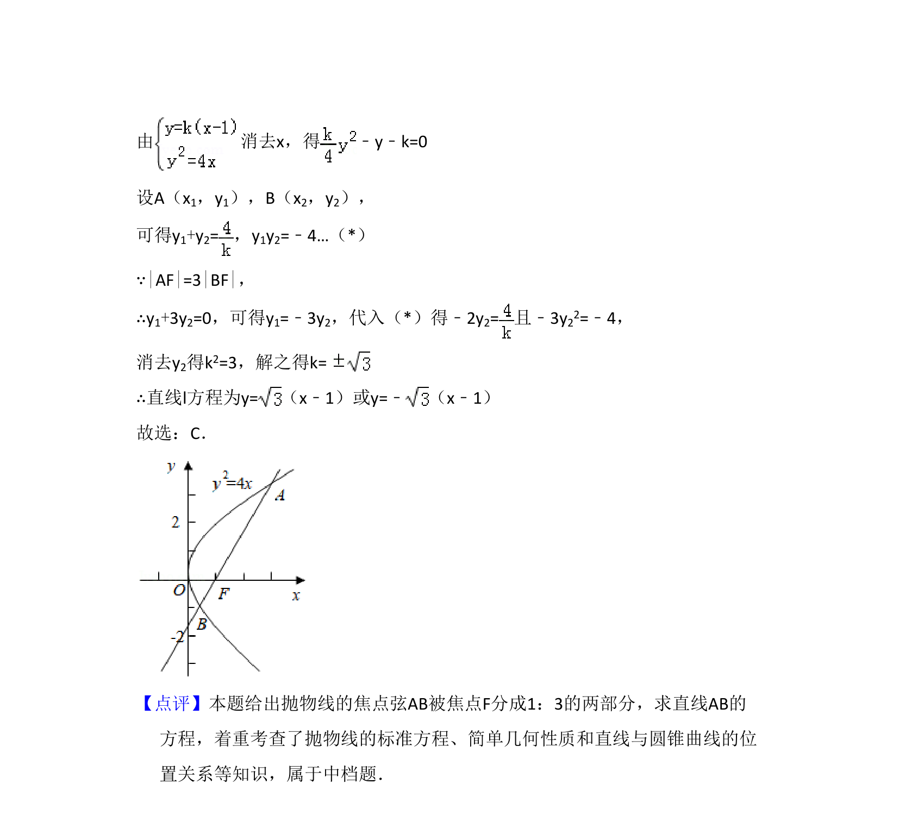

## 题面

## 摘要

本题考查抛物线焦点弦性质，通过直线与抛物线联立，利用弦长比例关系求解直线方程。

## 关联考点

- [[879-抛物线的性质|抛物线的性质]]
- [[1006-直线与圆锥曲线的位置关系|直线与圆锥曲线位置关系]]
- [[234-韦达定理-初中|韦达定理]]
- [[868-弦长关系|弦长关系]]

## 答案与解析

> 📄 原 PDF 第 8 页：`素材/真题/吉林/2008-2024·（吉林）数学高考真题/2013年高考数学试卷（文）（新课标Ⅱ）（解析卷）.pdf`

<!-- 题干文本-start -->
## 题干文本
10．（5分）设抛物线C：y2=4x的焦点为F，直线l过F且与C交于A，B两点．若|A
F|=3|BF|，则l的方程为（　　）
A．y=x﹣1或y=﹣x+1 B．y=（x﹣1）或 
y=﹣ （x﹣1）
C．y=（x﹣1）或 y=﹣ （x﹣1）D．y=（x﹣1）或 
y=﹣ （x﹣1）
<!-- 题干文本-end -->

<!-- 解析文本-start -->
## 解析文本
【考点】K8：抛物线的性质．菁优网版权所有
【专题】11：计算题；5D：圆锥曲线的定义、性质与方程．
【分析】根据题意，可得抛物线焦点为F（1，0），由此设直线l方程为y=k（x﹣
1），与抛物线方程联解消去x，得 ﹣y﹣k=0．再设A（x 1，y1），B（x2，
y2），由根与系数的关系和|AF|=3|BF|，建立关于y1、y2和k的方程组，解之
可得k值，从而得到直线l的方程．
【解答】解：∵抛物线C方程为y2=4x，可得它的焦点为F（1，0），
∴设直线l方程为y=k（x﹣1）
<!-- 解析文本-end -->
