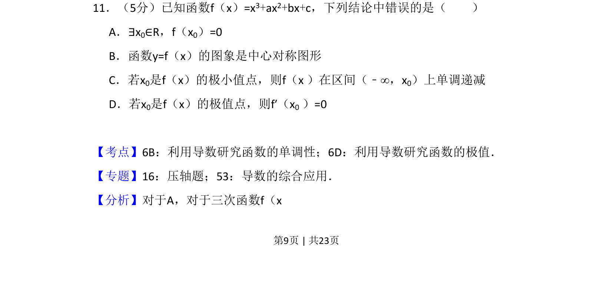
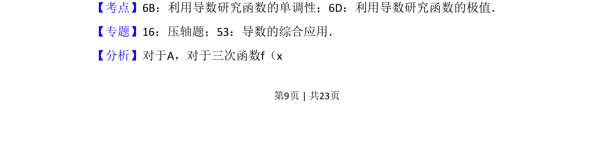
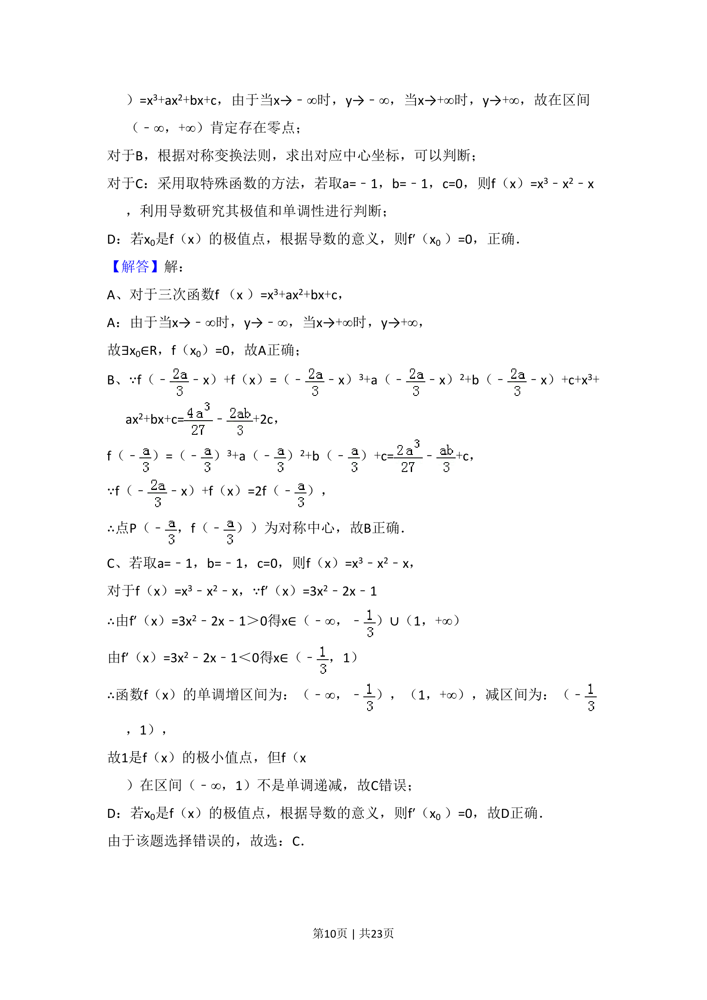
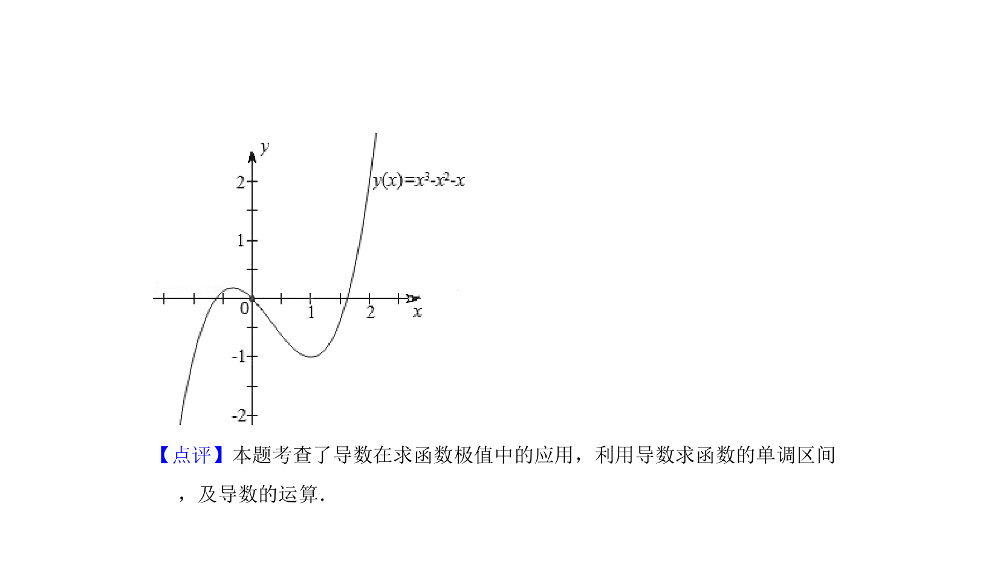

## 题面

## 摘要

本题考查三次函数的性质，包括零点存在性、对称性、单调性与极值点的关系。

## 关联考点

- [[705-利用导数研究函数的单调性|利用导数研究函数的单调性]]
- [[707-利用导数研究函数的极值|利用导数研究函数的极值]]
- [[601-三次函数的图象与性质|三次函数的图象与性质]]

## 答案与解析

> 📄 原 PDF 第 9 页：`素材/真题/吉林/2008-2024·（吉林）数学高考真题/2013年高考数学试卷（文）（新课标Ⅱ）（解析卷）.pdf`
