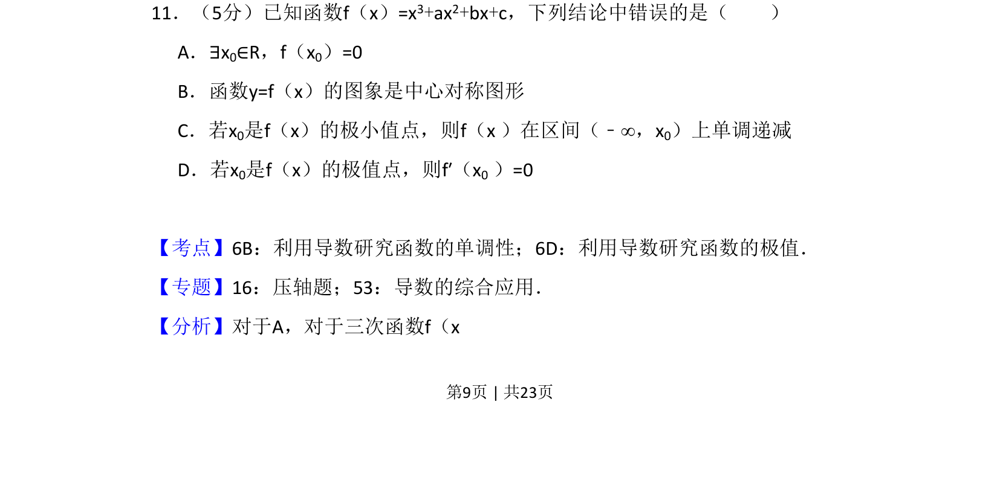
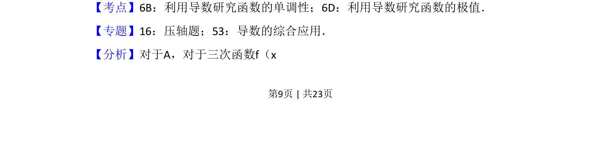
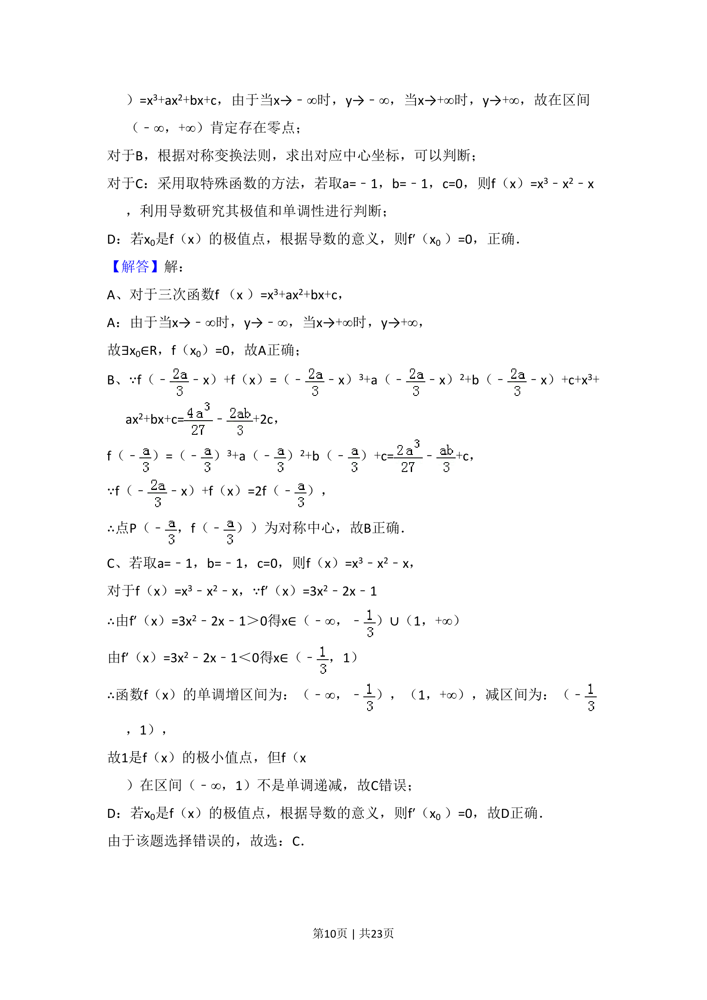
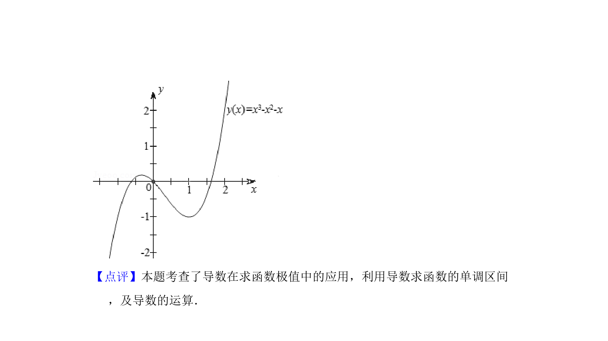

## 题面

## 摘要

本题考查三次函数的性质，包括零点存在性、对称性、单调性与极值点的关系。

## 关联考点

- [[705-利用导数研究函数的单调性|利用导数研究函数的单调性]]
- [[707-利用导数研究函数的极值|利用导数研究函数的极值]]
- [[601-三次函数的图象与性质|三次函数的图象与性质]]

## 答案与解析

> 📄 原 PDF 第 9 页：`素材/真题/吉林/2008-2024·（吉林）数学高考真题/2013年高考数学试卷（文）（新课标Ⅱ）（解析卷）.pdf`

<!-- 题干文本-start -->
## 题干文本
11．（5分）已知函数f（x）=x3+ax2+bx+c，下列结论中错误的是（　　）
A．∃x0∈R，f（x0）=0
B．函数y=f（x）的图象是中心对称图形
C．若x0是f（x）的极小值点，则f（x ）在区间（﹣∞，x0）上单调递减
D．若x0是f（x）的极值点，则f′（x0 ）=0
<!-- 题干文本-end -->

<!-- 解析文本-start -->
## 解析文本
【考点】6B：利用导数研究函数的单调性；6D：利用导数研究函数的极值．菁优网版权所有
【专题】16：压轴题；53：导数的综合应用．
【分析】对于A，对于三次函数f（x
<!-- 解析文本-end -->
