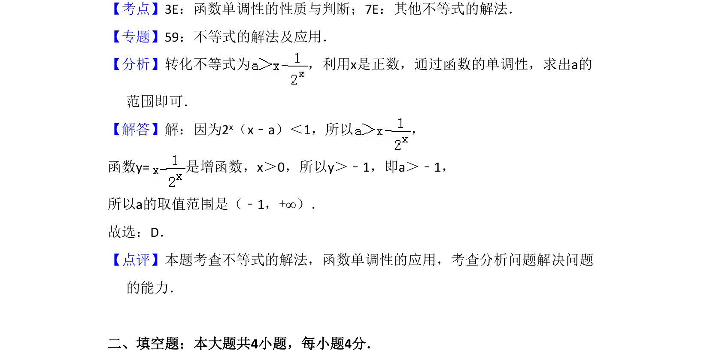

## 题面

## 摘要

存在正数x使2^x(x-a)<1成立，利用存在量词转化为最值问题求参数a的取值范围。

## 关联考点

- [[304-指数函数|指数函数]]
- [[531-不等式恒成立|不等式恒成立]]
- [[280-全称量词与存在量词|存在量词]]
- [[721-参数取值范围|参数取值范围]]

## 答案与解析

> 📄 原 PDF 第 11 页：`素材/真题/吉林/2008-2024·（吉林）数学高考真题/2013年高考数学试卷（文）（新课标Ⅱ）（解析卷）.pdf`
