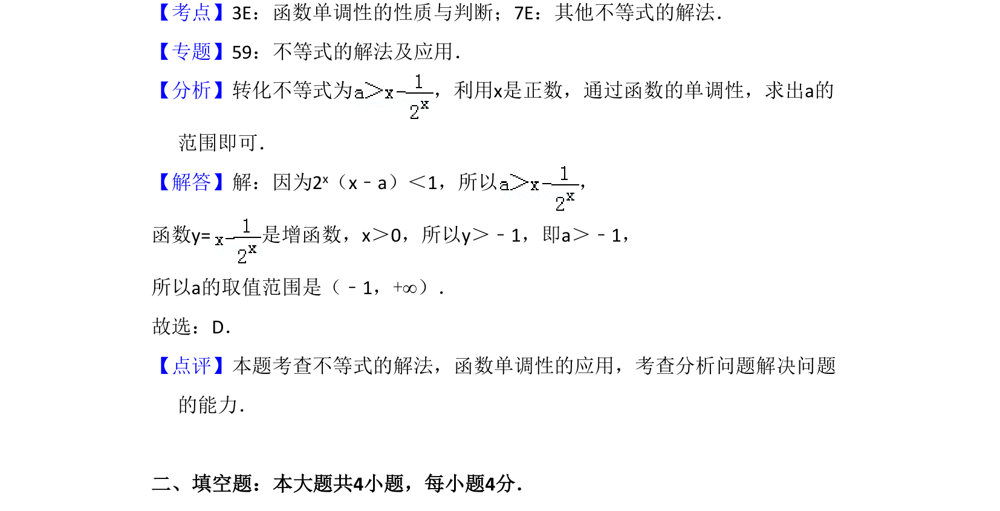

## 题面

## 摘要

存在正数x使2^x(x-a)<1成立，利用存在量词转化为最值问题求参数a的取值范围。

## 关联考点

- [[304-指数函数|指数函数]]
- [[531-不等式恒成立|不等式恒成立]]
- [[280-全称量词与存在量词|存在量词]]
- [[721-参数取值范围|参数取值范围]]

## 答案与解析

> 📄 原 PDF 第 11 页：`素材/真题/吉林/2008-2024·（吉林）数学高考真题/2013年高考数学试卷（文）（新课标Ⅱ）（解析卷）.pdf`

<!-- 题干文本-start -->
## 题干文本
12．（5分）若存在正数x使2x（x﹣a）＜1成立，则a的取值范围是（　　）
A．（﹣∞，+∞）B．（﹣2，+∞）C．（0，+∞）D．（﹣1，+∞）
<!-- 题干文本-end -->

<!-- 解析文本-start -->
## 解析文本
【考点】3E：函数单调性的性质与判断；7E：其他不等式的解法．菁优网版权所有
【专题】59：不等式的解法及应用．
【分析】转化不等式为 ，利用x是正数，通过函数的单调性，求出a的
范围即可．
【解答】解：因为2x（x﹣a）＜1，所以 ，
函数y=是增函数，x＞0，所以y＞﹣1，即a＞﹣1，
所以a的取值范围是（﹣1，+∞）．
故选：D．
【点评】本题考查不等式的解法，函数单调性的应用，考查分析问题解决问题
的能力．
　
二、填空题：本大题共4小题，每小题4分．
<!-- 解析文本-end -->
