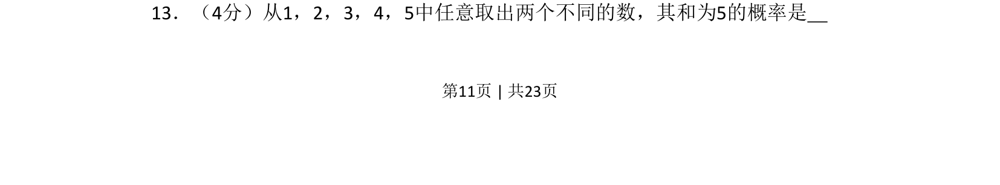
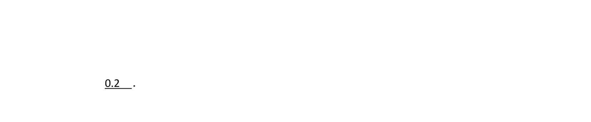
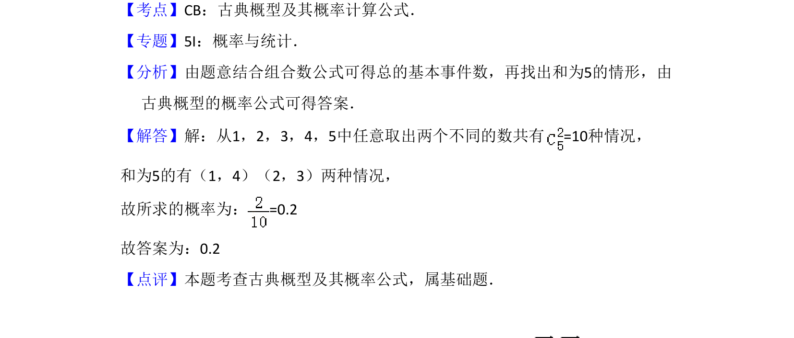

## 题面

## 摘要

从五个数字中取两个不同数，计算和为5的古典概率。

## 关联考点

- [[320-古典概型|古典概型]]
- [[1090-组合计数|组合计数]]
- [[948-概率计算|概率计算]]

## 答案与解析

> 📄 原 PDF 第 11 页：`素材/真题/吉林/2008-2024·（吉林）数学高考真题/2013年高考数学试卷（文）（新课标Ⅱ）（解析卷）.pdf`
