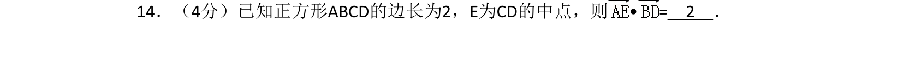
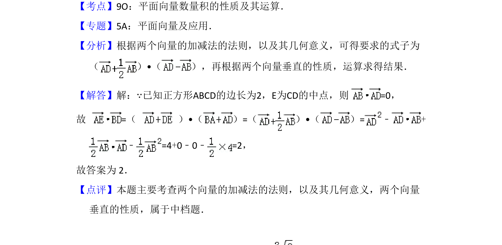

## 题面

## 摘要

该题通过正方形中向量的线性运算求数量积，考查向量加减法的几何意义与垂直性质。

## 关联考点

- [[平面向量数量积]]
- [[向量加减法的几何意义]]
- [[向量垂直性质]]

## 答案与解析

> 📄 原 PDF 第 12 页：`素材/真题/吉林/2008-2024·（吉林）数学高考真题/2013年高考数学试卷（文）（新课标Ⅱ）（解析卷）.pdf`
