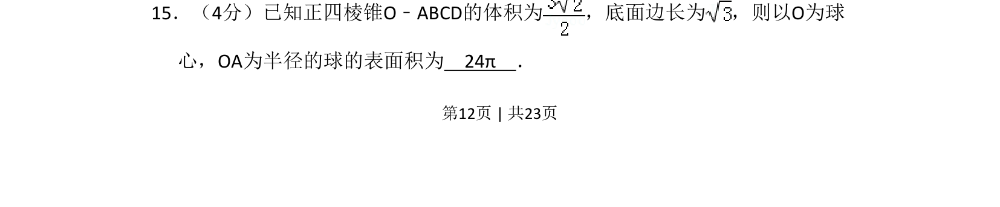
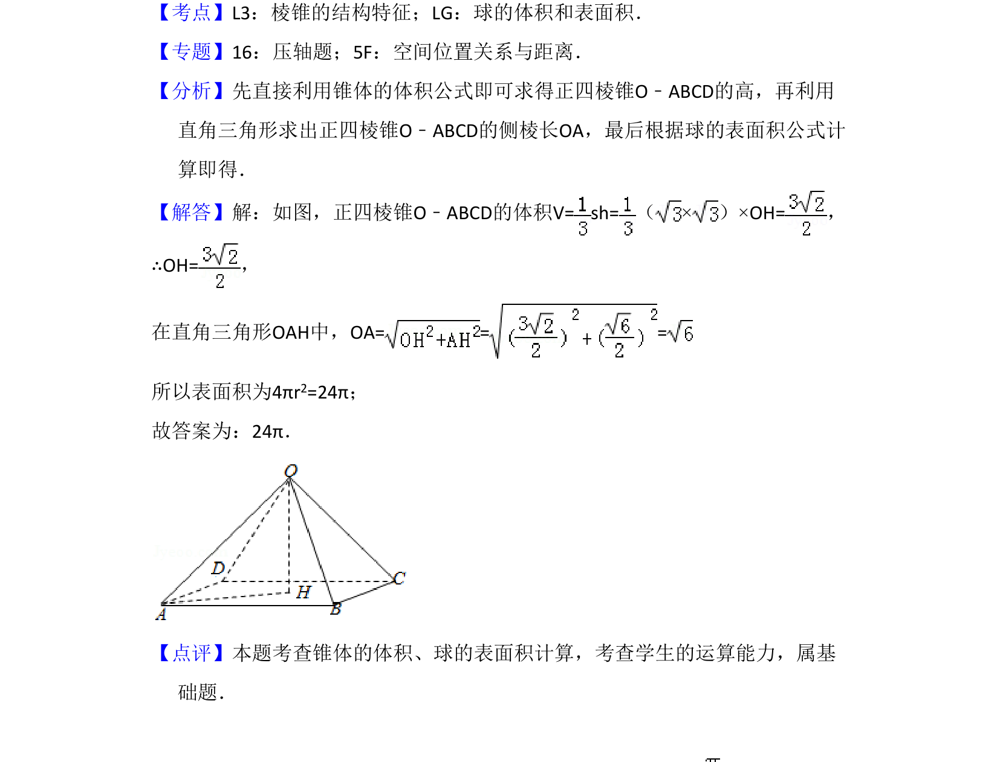

## 题面

## 摘要

求正四棱锥的体积和底面边长，进而计算其外接球的表面积。

## 关联考点

- [[936-棱锥体积|棱锥体积]]
- [[993-球的表面积|球的表面积]]
- [[1049-空间几何计算|空间几何计算]]

## 答案与解析

> 📄 原 PDF 第 12 页：`素材/真题/吉林/2008-2024·（吉林）数学高考真题/2013年高考数学试卷（文）（新课标Ⅱ）（解析卷）.pdf`
