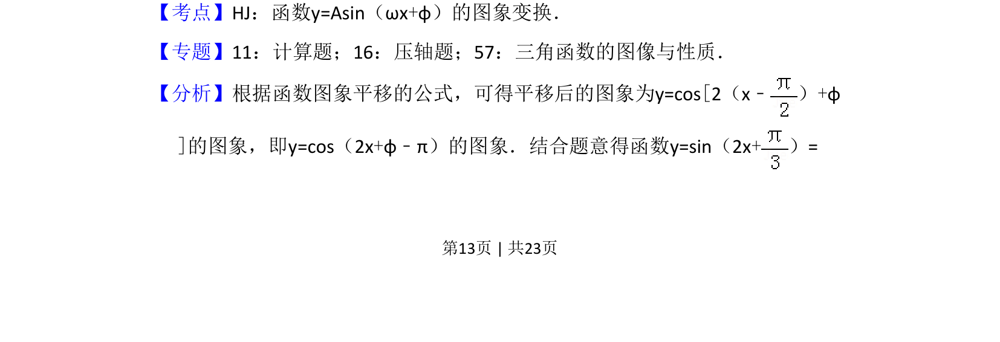
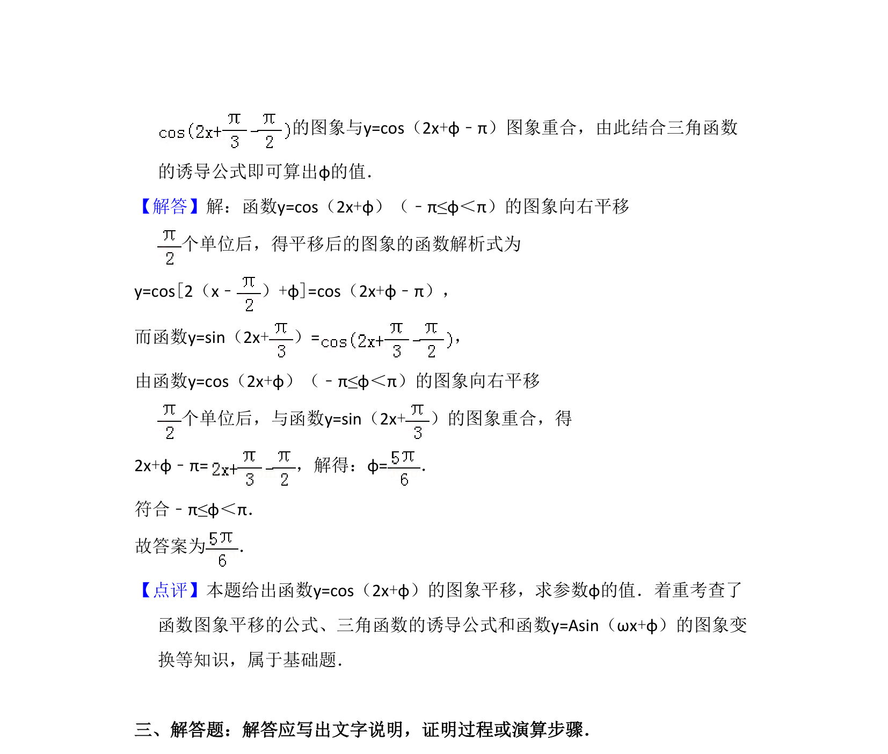

## 题面

## 摘要

函数图象平移后与给定三角函数重合，求参数φ

## 关联考点

- [[673-函数y=Asin(ωx+φ)的图象变换|函数y=Asin(ωx+φ)的图象变换]]
- [[612-三角函数的图像与性质|三角函数的图像与性质]]

## 答案与解析

> 📄 原 PDF 第 13 页：`素材/真题/吉林/2008-2024·（吉林）数学高考真题/2013年高考数学试卷（文）（新课标Ⅱ）（解析卷）.pdf`
