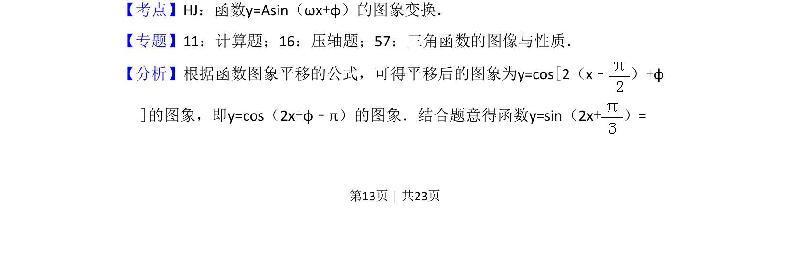
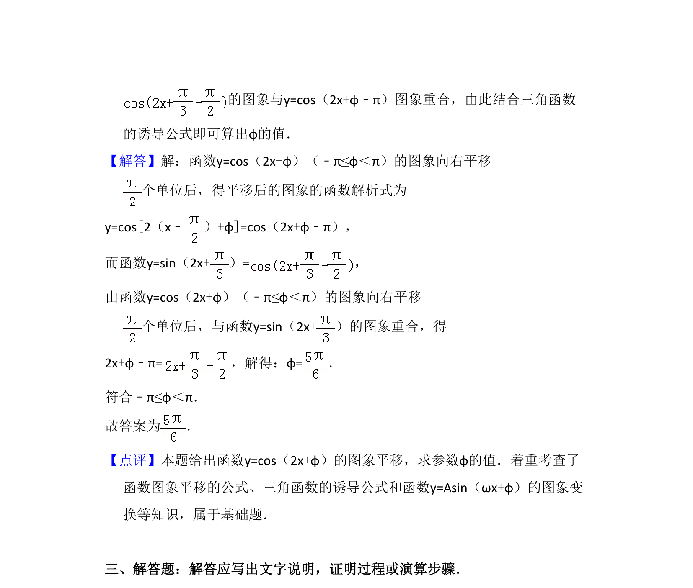

## 题面

## 摘要

函数图象平移后与给定三角函数重合，求参数φ

## 关联考点

- [[673-函数y=Asin(ωx+φ)的图象变换|函数y=Asin(ωx+φ)的图象变换]]
- [[612-三角函数的图像与性质|三角函数的图像与性质]]

## 答案与解析

> 📄 原 PDF 第 13 页：`素材/真题/吉林/2008-2024·（吉林）数学高考真题/2013年高考数学试卷（文）（新课标Ⅱ）（解析卷）.pdf`

<!-- 题干文本-start -->
## 题干文本
16．（4分）函数y=cos（2x+φ）（﹣π≤φ＜π）的图象向右平移 个单位后，与
函数y=sin（2x+）的图象重合，则φ=　 　．
<!-- 题干文本-end -->

<!-- 解析文本-start -->
## 解析文本
【考点】HJ：函数y=Asin（ωx+φ）的图象变换．菁优网版权所有
【专题】11：计算题；16：压轴题；57：三角函数的图像与性质．
【分析】根据函数图象平移的公式，可得平移后的图象为y=cos[2（x﹣ ）+φ
]的图象，即y=cos（2x+φ﹣π）的图象．结合题意得函数y=sin（2x+）=
<!-- 解析文本-end -->
