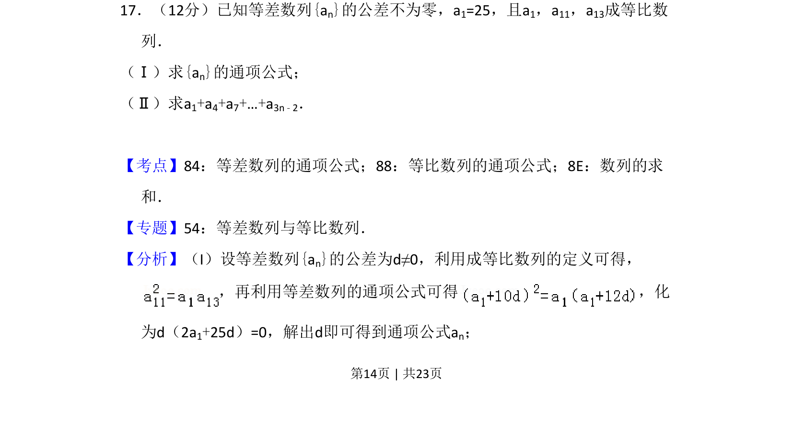
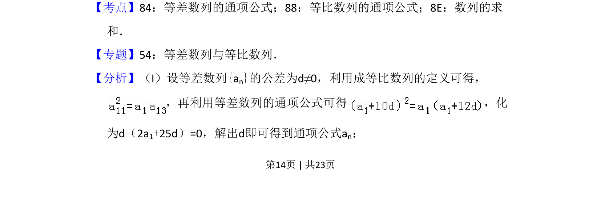
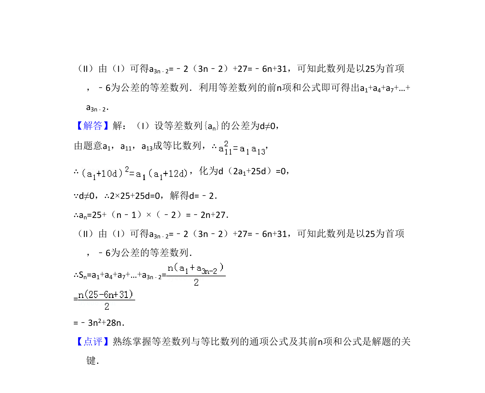

## 题面

## 摘要

本题通过等差与等比数列综合条件求通项，并对特定间隔项进行求和。

## 关联考点

- [[1063-等差数列通项公式|等差数列通项公式]]
- [[1064-等比中项|等比中项]]
- [[1081-累加求和|数列求和]]

## 答案与解析

> 📄 原 PDF 第 14 页：`素材/真题/吉林/2008-2024·（吉林）数学高考真题/2013年高考数学试卷（文）（新课标Ⅱ）（解析卷）.pdf`

<!-- 题干文本-start -->
## 题干文本
17．（12分）已知等差数列{an}的公差不为零，a1=25，且a1，a11，a13成等比数
列．
（Ⅰ）求{an}的通项公式；
（Ⅱ）求a1+a4+a7+…+a3n﹣2．
<!-- 题干文本-end -->

<!-- 解析文本-start -->
## 解析文本
【考点】84：等差数列的通项公式；88：等比数列的通项公式；8E：数列的求
和．菁优网版权所有
【专题】54：等差数列与等比数列．
【分析】（I）设等差数列{an}的公差为d≠0，利用成等比数列的定义可得，
，再利用等差数列的通项公式可得 ，化
为d（2a1+25d）=0，解出d即可得到通项公式an；
<!-- 解析文本-end -->
