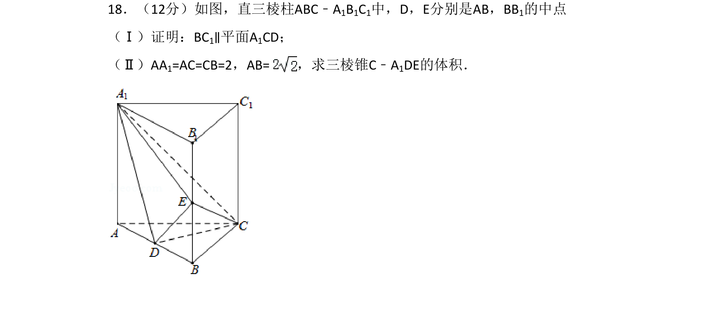
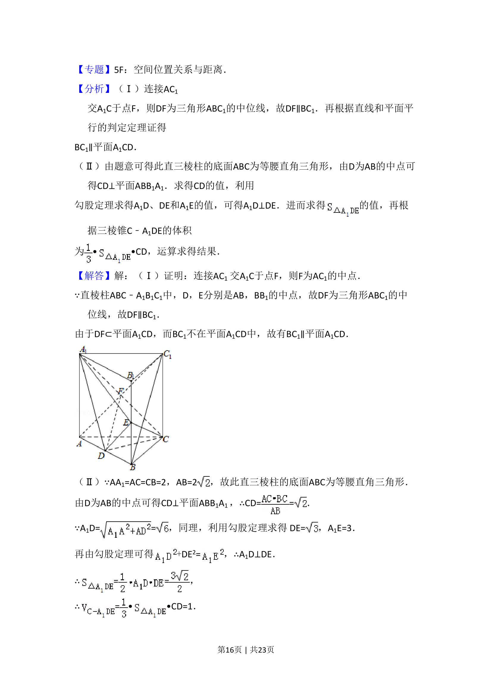
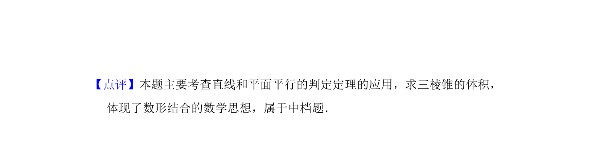

## 题面

## 摘要

证明线面平行，并求三棱锥的体积

## 关联考点

- [[1011-直线与平面平行|直线与平面平行]]
- [[936-棱锥体积|棱锥体积]]

## 答案与解析

> 📄 原 PDF 第 15 页：`素材/真题/吉林/2008-2024·（吉林）数学高考真题/2013年高考数学试卷（文）（新课标Ⅱ）（解析卷）.pdf`

<!-- 题干文本-start -->
## 题干文本
18．（12分）如图，直三棱柱ABC﹣A1B1C1中，D，E分别是AB，BB1的中点
（Ⅰ）证明：BC1∥平面A1CD；
（Ⅱ）AA1=AC=CB=2，AB=，求三棱锥C﹣A 1DE的体积．
<!-- 题干文本-end -->

<!-- 解析文本-start -->
## 解析文本
【考点】LF：棱柱、棱锥、棱台的体积；LS：直线与平面平行．菁优网版权所有
<!-- 解析文本-end -->
