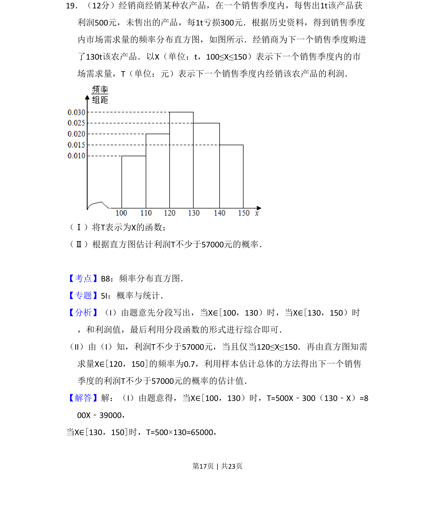
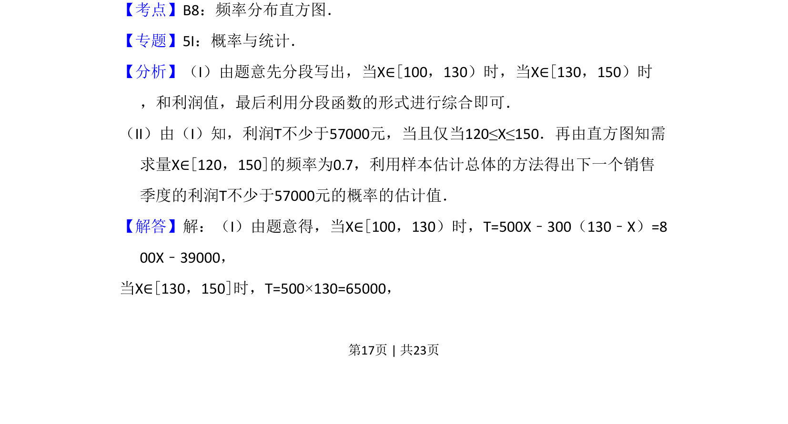
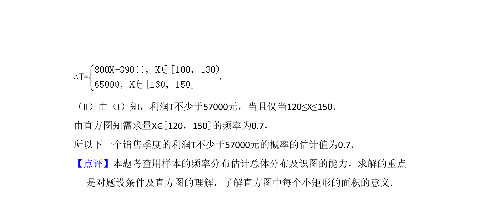

## 题面

## 摘要

本题要求根据市场需求量频率分布直方图，建立利润关于需求量的分段函数，并估计利润不小于某值的概率。

## 关联考点

- [[290-分段函数|分段函数]]
- [[364-频率分布直方图|频率分布直方图]]
- [[1187-概率估计|概率估计]]
- [[930-样本估计总体|样本估计总体]]

## 答案与解析

> 📄 原 PDF 第 17 页：`素材/真题/吉林/2008-2024·（吉林）数学高考真题/2013年高考数学试卷（文）（新课标Ⅱ）（解析卷）.pdf`
