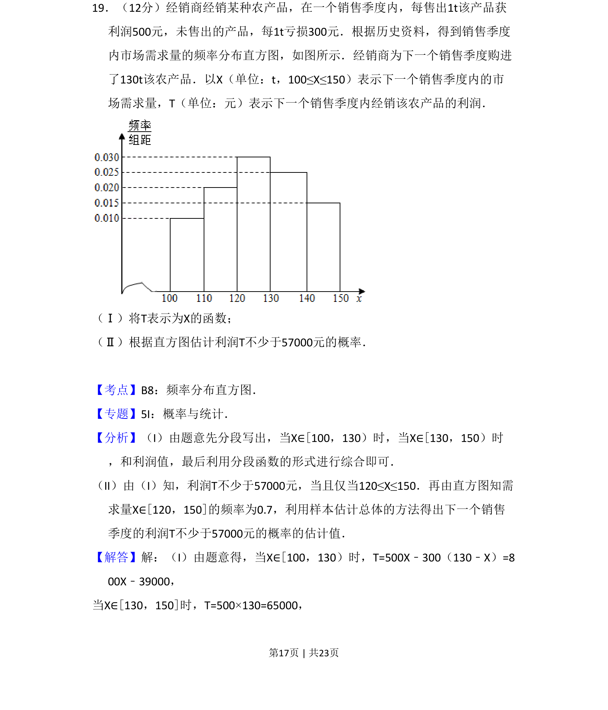
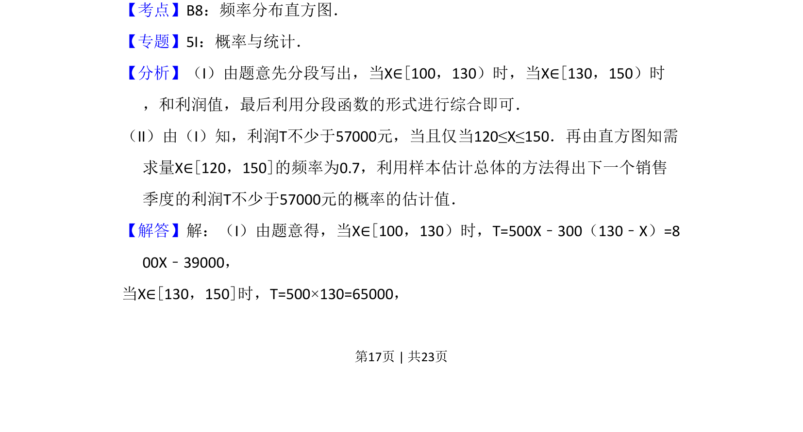
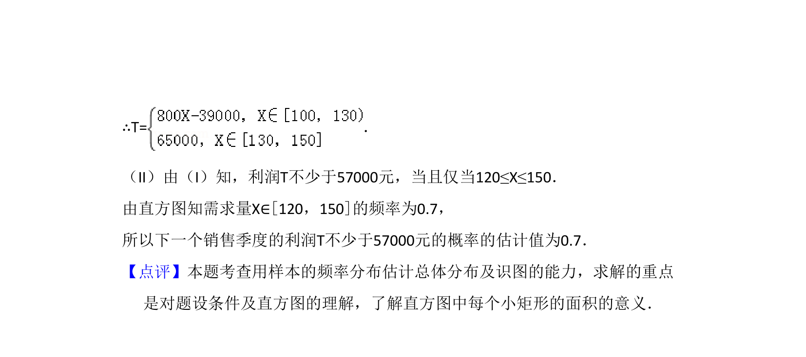

## 题面

## 摘要

本题要求根据市场需求量频率分布直方图，建立利润关于需求量的分段函数，并估计利润不小于某值的概率。

## 关联考点

- [[290-分段函数|分段函数]]
- [[364-频率分布直方图|频率分布直方图]]
- [[1186-概率估计|概率估计]]
- [[929-样本估计总体|样本估计总体]]

## 答案与解析

> 📄 原 PDF 第 17 页：`素材/真题/吉林/2008-2024·（吉林）数学高考真题/2013年高考数学试卷（文）（新课标Ⅱ）（解析卷）.pdf`

<!-- 题干文本-start -->
## 题干文本
19．（12分）经销商经销某种农产品，在一个销售季度内，每售出1t该产品获
利润500元，未售出的产品，每1t亏损300元．根据历史资料，得到销售季度
内市场需求量的频率分布直方图，如图所示．经销商为下一个销售季度购进
了130t该农产品．以X（单位：t，100≤X≤150）表示下一个销售季度内的市
场需求量，T（单位：元）表示下一个销售季度内经销该农产品的利润．
（Ⅰ）将T表示为X的函数；
（Ⅱ）根据直方图估计利润T不少于57000元的概率．
<!-- 题干文本-end -->

<!-- 解析文本-start -->
## 解析文本
【考点】B8：频率分布直方图．菁优网版权所有
【专题】5I：概率与统计．
【分析】（I）由题意先分段写出，当X∈[100，130）时，当X∈[130，150）时
，和利润值，最后利用分段函数的形式进行综合即可．
（II）由（I）知，利润T不少于57000元，当且仅当120≤X≤150．再由直方图知需
求量X∈[120，150]的频率为0.7，利用样本估计总体的方法得出下一个销售
季度的利润T不少于57000元的概率的估计值．
【解答】解：（I）由题意得，当X∈[100，130）时，T=500X﹣300（130﹣X）=8
00X﹣39000，
当X∈[130，150]时，T=500×130=65000，
<!-- 解析文本-end -->
