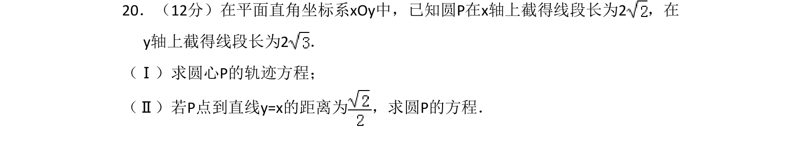
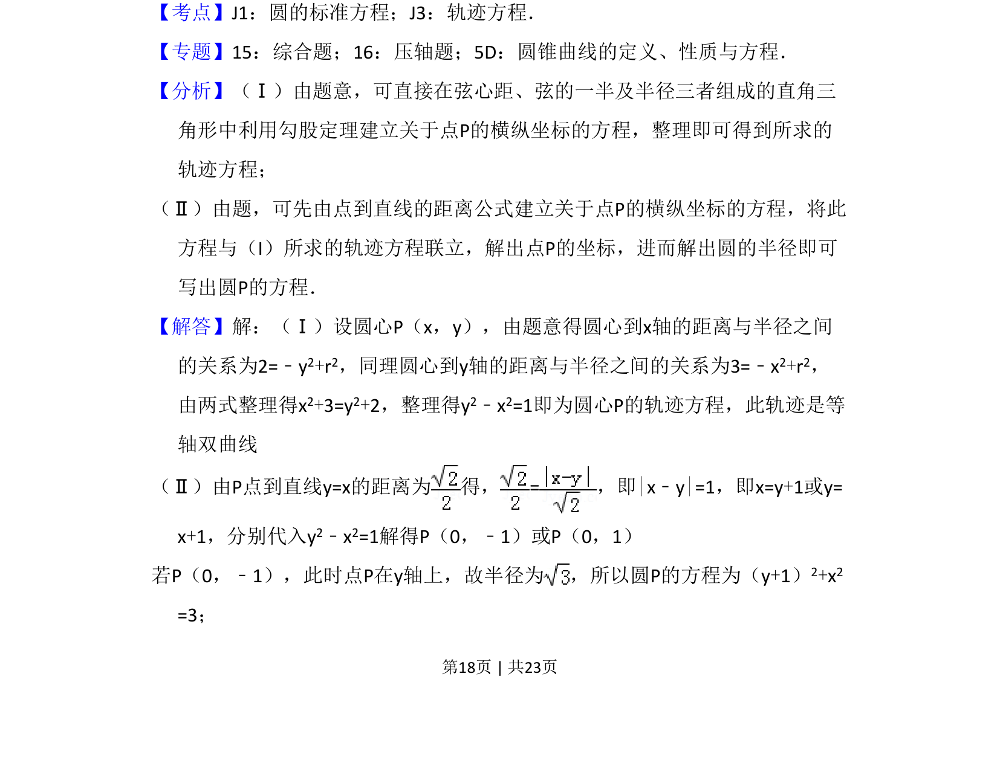
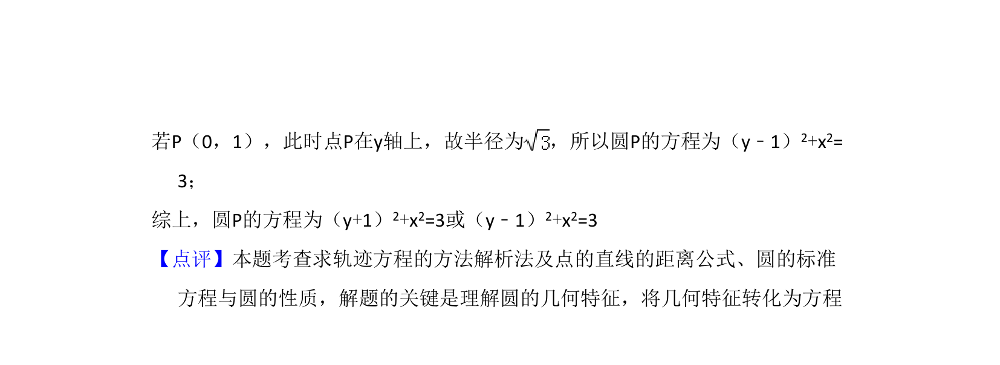

## 题面

## 摘要

求圆心轨迹方程并利用点到直线距离求圆的方程

## 关联考点

- [[373-圆的标准方程|圆的标准方程]]
- [[376-圆锥曲线轨迹问题|轨迹方程]]
- [[1212-点到直线距离|点到直线距离]]

## 答案与解析

> 📄 原 PDF 第 18 页：`素材/真题/吉林/2008-2024·（吉林）数学高考真题/2013年高考数学试卷（文）（新课标Ⅱ）（解析卷）.pdf`
