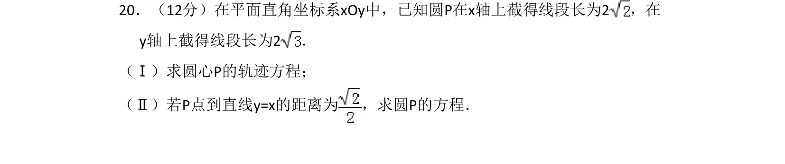
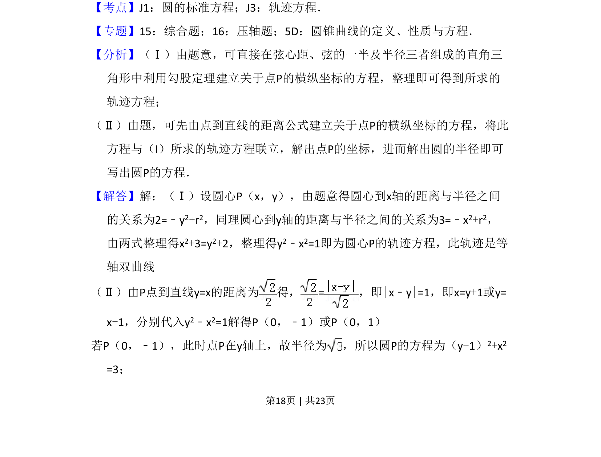
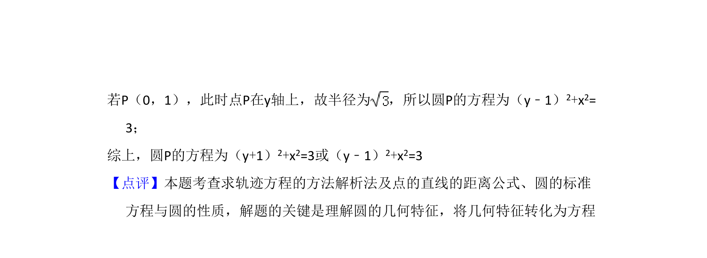

## 题面

## 摘要

求圆心轨迹方程并利用点到直线距离求圆的方程

## 关联考点

- [[373-圆的标准方程|圆的标准方程]]
- [[376-圆锥曲线轨迹问题|轨迹方程]]
- [[1211-点到直线距离|点到直线距离]]

## 答案与解析

> 📄 原 PDF 第 18 页：`素材/真题/吉林/2008-2024·（吉林）数学高考真题/2013年高考数学试卷（文）（新课标Ⅱ）（解析卷）.pdf`

<!-- 题干文本-start -->
## 题干文本
20．（12分）在平面直角坐标系xOy中，已知圆P在x轴上截得线段长为2，在
y轴上截得线段长为2．
（Ⅰ）求圆心P的轨迹方程；
（Ⅱ）若P点到直线y=x的距离为 ，求圆P的方程．
<!-- 题干文本-end -->

<!-- 解析文本-start -->
## 解析文本
【考点】J1：圆的标准方程；J3：轨迹方程．菁优网版权所有
【专题】15：综合题；16：压轴题；5D：圆锥曲线的定义、性质与方程．
【分析】（Ⅰ）由题意，可直接在弦心距、弦的一半及半径三者组成的直角三
角形中利用勾股定理建立关于点P的横纵坐标的方程，整理即可得到所求的
轨迹方程；
（Ⅱ）由题，可先由点到直线的距离公式建立关于点P的横纵坐标的方程，将此
方程与（I）所求的轨迹方程联立，解出点P的坐标，进而解出圆的半径即可
写出圆P的方程．
【解答】解：（Ⅰ）设圆心P（x，y），由题意得圆心到x轴的距离与半径之间
的关系为2=﹣y2+r2，同理圆心到y轴的距离与半径之间的关系为3=﹣x2+r2，
由两式整理得x2+3=y2+2，整理得y2﹣x2=1即为圆心P的轨迹方程，此轨迹是等
轴双曲线
（Ⅱ）由P点到直线y=x的距离为 得，=，即|x﹣y|=1，即x=y+1或y=
x+1，分别代入y2﹣x2=1解得P（0，﹣1）或P（0，1）
若P（0，﹣1），此时点P在y轴上，故半径为 ，所以圆P的方程为（y+1） 2+x2
=3；
<!-- 解析文本-end -->
