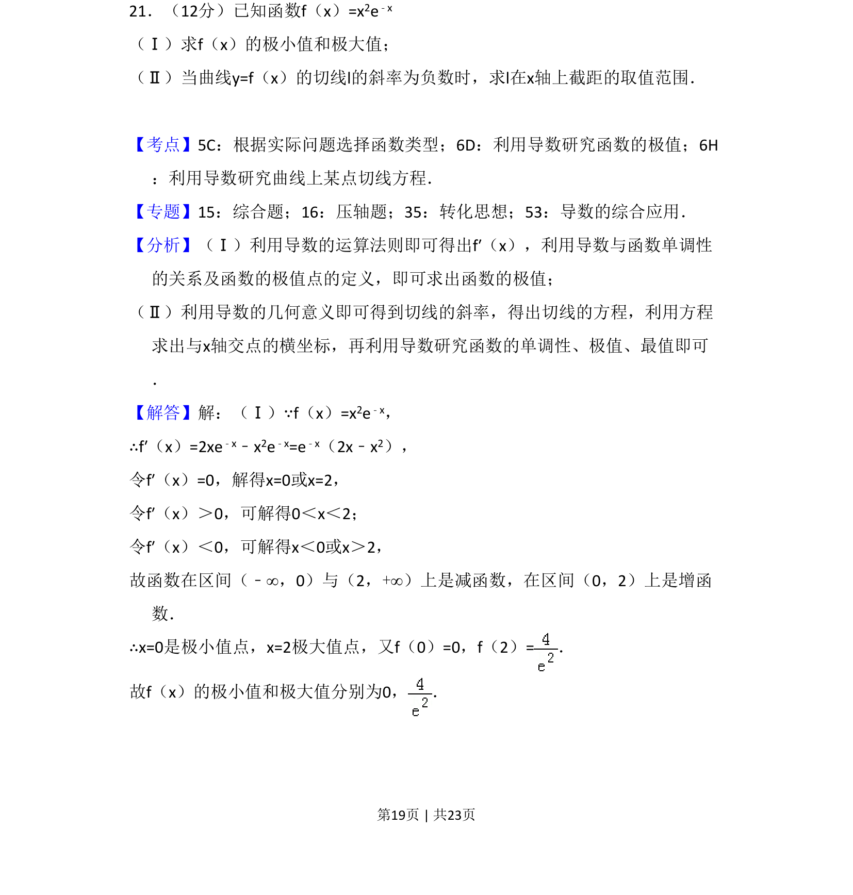

## 题面

## 摘要

利用导数求函数的极值，并分析切线斜率与截距的取值范围。

## 关联考点

- [[利用导数研究函数的极值]]
- [[利用导数研究曲线上某点切线方程]]
- [[286-函数的最值|函数的最值]]

## 答案与解析

> 📄 原 PDF 第 19 页：`素材/真题/吉林/2008-2024·（吉林）数学高考真题/2013年高考数学试卷（文）（新课标Ⅱ）（解析卷）.pdf`
