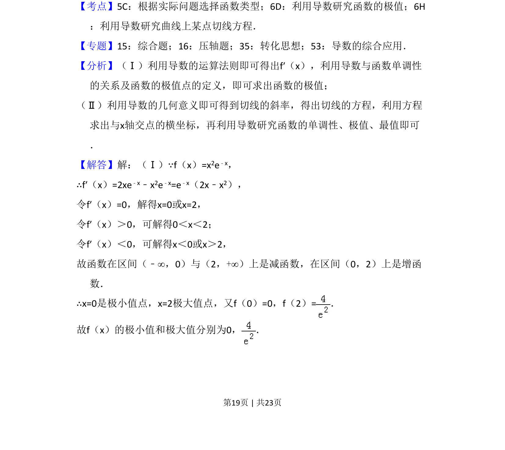
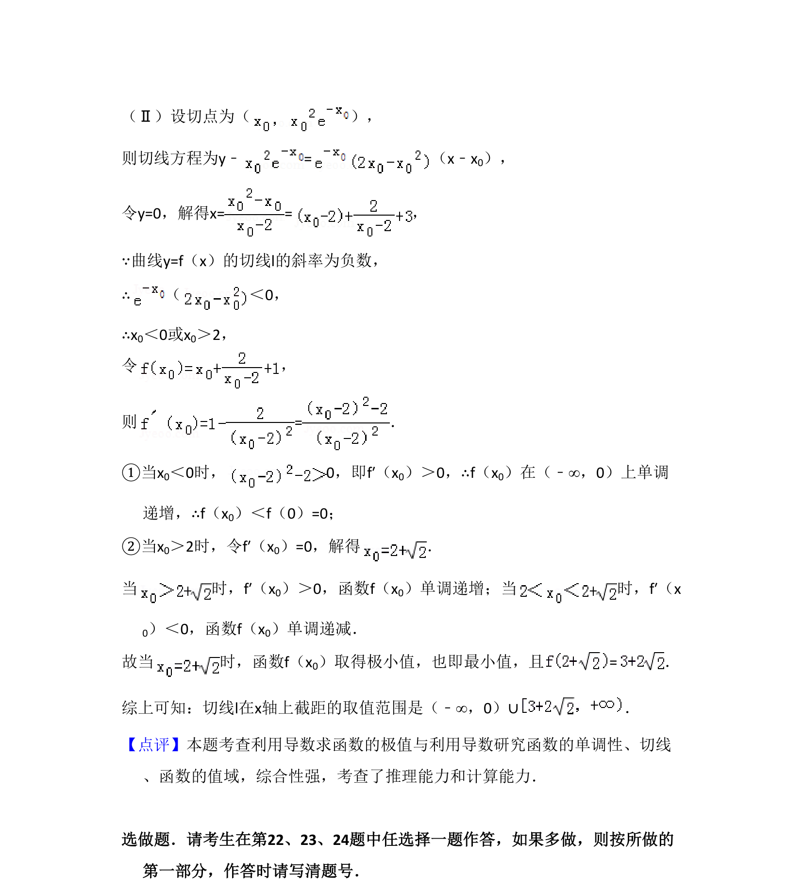

## 题面

## 摘要

利用导数求函数的极值，并分析切线斜率与截距的取值范围。

## 关联考点

- [[707-利用导数研究函数的极值|利用导数研究函数的极值]]
- [[710-利用导数研究曲线上某点切线方程|利用导数研究曲线上某点切线方程]]
- [[286-函数的最值|函数的最值]]

## 答案与解析

> 📄 原 PDF 第 19 页：`素材/真题/吉林/2008-2024·（吉林）数学高考真题/2013年高考数学试卷（文）（新课标Ⅱ）（解析卷）.pdf`

<!-- 题干文本-start -->
## 题干文本
21．（12分）已知函数f（x）=x2e﹣x
（Ⅰ）求f（x）的极小值和极大值；
（Ⅱ）当曲线y=f（x）的切线l的斜率为负数时，求l在x轴上截距的取值范围．
<!-- 题干文本-end -->

<!-- 解析文本-start -->
## 解析文本
【考点】5C：根据实际问题选择函数类型；6D：利用导数研究函数的极值；6H
：利用导数研究曲线上某点切线方程．菁优网版权所有
【专题】15：综合题；16：压轴题；35：转化思想；53：导数的综合应用．
【分析】（Ⅰ）利用导数的运算法则即可得出f′（x），利用导数与函数单调性
的关系及函数的极值点的定义，即可求出函数的极值；
（Ⅱ）利用导数的几何意义即可得到切线的斜率，得出切线的方程，利用方程
求出与x轴交点的横坐标，再利用导数研究函数的单调性、极值、最值即可
．
【解答】解：（Ⅰ）∵f（x）=x2e﹣x，
∴f′（x）=2xe﹣x﹣x2e﹣x=e﹣x（2x﹣x2），
令f′（x）=0，解得x=0或x=2，
令f′（x）＞0，可解得0＜x＜2；
令f′（x）＜0，可解得x＜0或x＞2，
故函数在区间（﹣∞，0）与（2，+∞）上是减函数，在区间（0，2）上是增函
数．
∴x=0是极小值点，x=2极大值点，又f（0）=0，f（2）=．
故f（x）的极小值和极大值分别为0， ．
<!-- 解析文本-end -->
