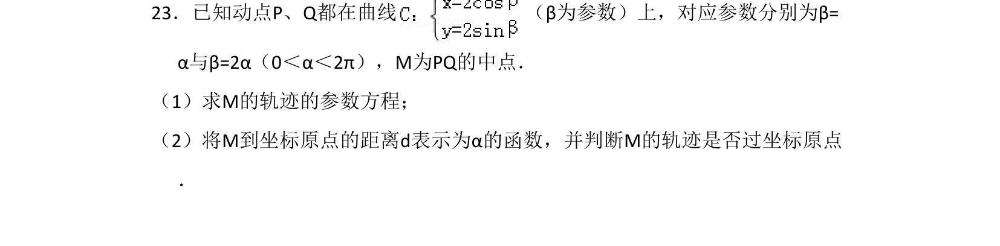
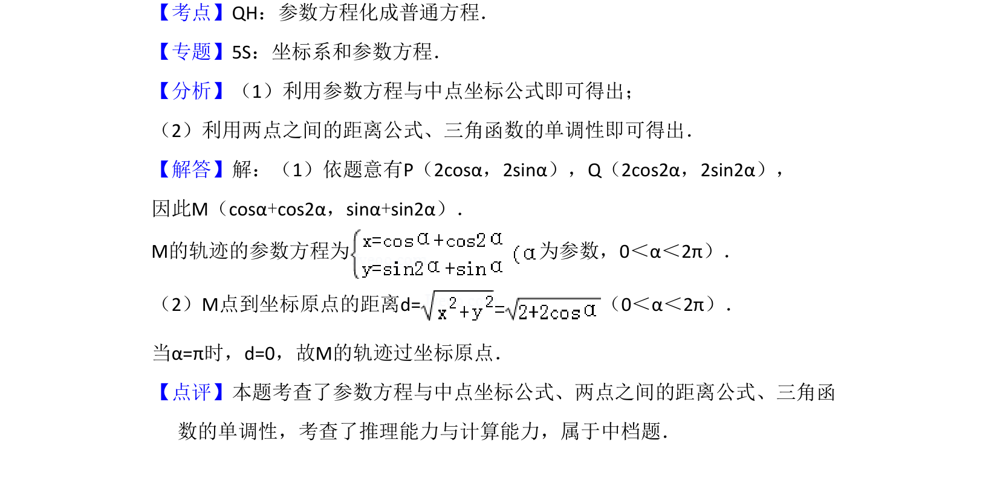

## 题面

## 摘要

已知动点P、Q在参数曲线上，求中点M的轨迹参数方程，并将距离d表示为α的函数，判断轨迹是否过原点。

## 关联考点

- [[061-方程|参数方程]]
- [[中点坐标公式]]
- [[两点间距离公式]]
- [[270-三角函数应用|三角函数]]

## 答案与解析

> 📄 原 PDF 第 22 页：`素材/真题/吉林/2008-2024·（吉林）数学高考真题/2013年高考数学试卷（文）（新课标Ⅱ）（解析卷）.pdf`
