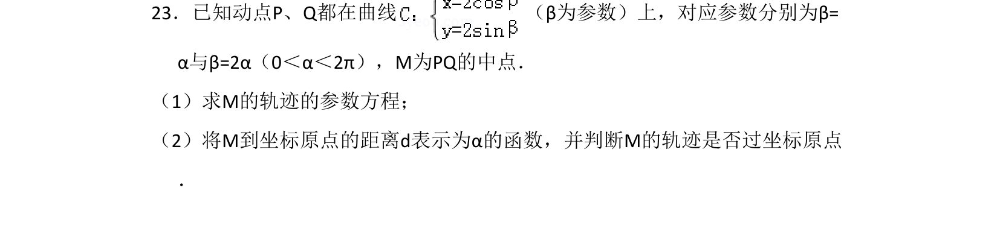
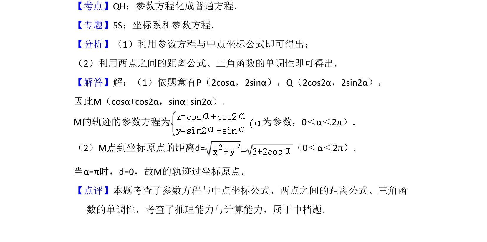

## 题面

## 摘要

已知动点P、Q在参数曲线上，求中点M的轨迹参数方程，并将距离d表示为α的函数，判断轨迹是否过原点。

## 关联考点

- [[061-方程|参数方程]]
- [[635-中点坐标公式|中点坐标公式]]
- [[626-两点间距离公式|两点间距离公式]]
- [[270-三角函数应用|三角函数]]

## 答案与解析

> 📄 原 PDF 第 22 页：`素材/真题/吉林/2008-2024·（吉林）数学高考真题/2013年高考数学试卷（文）（新课标Ⅱ）（解析卷）.pdf`

<!-- 题干文本-start -->
## 题干文本
23．已知动点P、Q都在曲线 （β为参数）上，对应参数分别为β=
α与β=2α（0＜α＜2π），M为PQ的中点．
（1）求M的轨迹的参数方程；
（2）将M到坐标原点的距离d表示为α的函数，并判断M的轨迹是否过坐标原点
．
<!-- 题干文本-end -->

<!-- 解析文本-start -->
## 解析文本
【考点】QH：参数方程化成普通方程．菁优网版权所有
【专题】5S：坐标系和参数方程．
【分析】（1）利用参数方程与中点坐标公式即可得出；
（2）利用两点之间的距离公式、三角函数的单调性即可得出．
【解答】解：（1）依题意有P（2cosα，2sinα），Q（2cos2α，2sin2α），
因此M（cosα+cos2α，sinα+sin2α）．
M的轨迹的参数方程为 为参数，0＜α＜2π）．
（2）M点到坐标原点的距离d=（0＜α＜2π）．
当α=π时，d=0，故M的轨迹过坐标原点．
【点评】本题考查了参数方程与中点坐标公式、两点之间的距离公式、三角函
数的单调性，考查了推理能力与计算能力，属于中档题．
<!-- 解析文本-end -->
