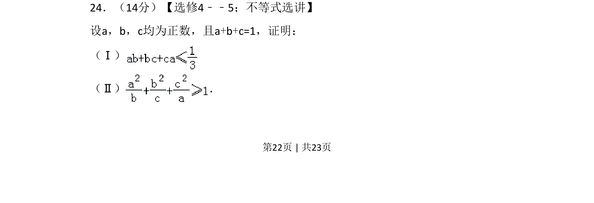
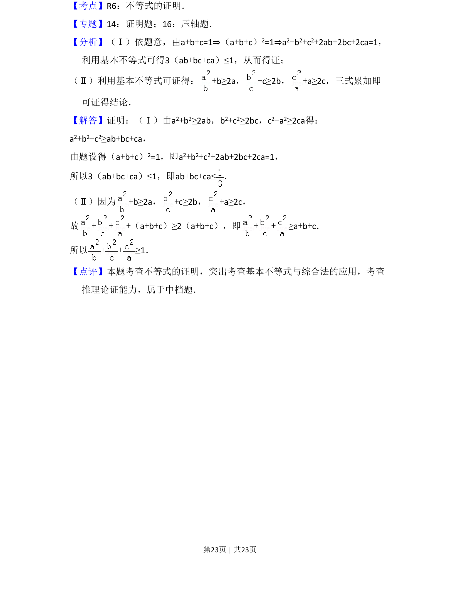

## 题面

## 摘要

本题要求证明给定正数和为1条件下的两个不等式，考查不等式证明方法与技巧。

## 关联考点

- [[625-不等式证明|不等式证明]]
- [[295-基本不等式|均值不等式]]
- [[928-柯西不等式|柯西不等式]]
- [[561-条件极值|条件极值]]

## 答案与解析

> 📄 原 PDF 第 22 页：`素材/真题/吉林/2008-2024·（吉林）数学高考真题/2013年高考数学试卷（文）（新课标Ⅱ）（解析卷）.pdf`
