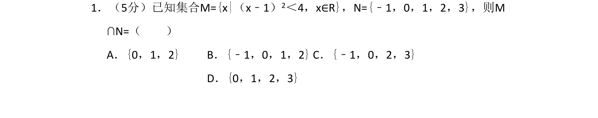
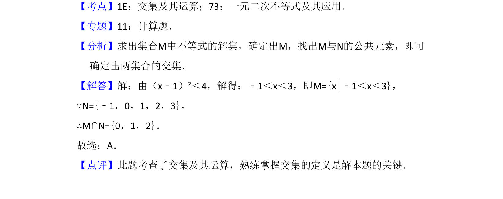

## 题面

## 摘要

求一元二次不等式解集并计算与已知整数集合的交集。

## 关联考点

- [[267-一元二次不等式|一元二次不等式]]
- [[645-交集及其运算|交集及其运算]]

## 答案与解析

> 📄 原 PDF 第 1 页：`素材/真题/吉林/2008-2024·（吉林）数学高考真题/2013年高考数学试卷（理）（新课标Ⅱ）（解析卷）.pdf`

<!-- 题干文本-start -->
## 题干文本
1．（5分）已知集合M={x|（x﹣1）2＜4，x∈R}，N={﹣1，0，1，2，3}，则M
∩N=（　　）
A．{0，1，2}B．{﹣1，0，1，2}C．{﹣1，0，2，3}
D．{0，1，2，3}
<!-- 题干文本-end -->

<!-- 解析文本-start -->
## 解析文本
【考点】1E：交集及其运算；73：一元二次不等式及其应用．菁优网版权所有
【专题】11：计算题．
【分析】求出集合M中不等式的解集，确定出M，找出M与N的公共元素，即可
确定出两集合的交集．
【解答】解：由（x﹣1）2＜4，解得：﹣1＜x＜3，即M={x|﹣1＜x＜3}，
∵N={﹣1，0，1，2，3}，
∴M∩N={0，1，2}．
故选：A．
【点评】此题考查了交集及其运算，熟练掌握交集的定义是解本题的关键．
<!-- 解析文本-end -->
