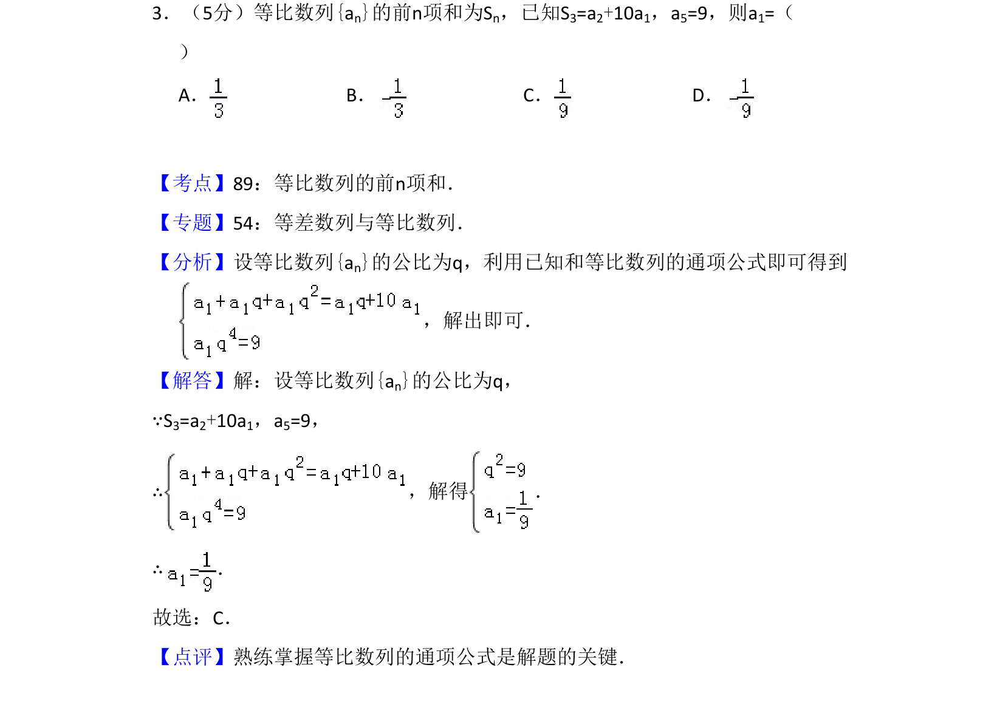
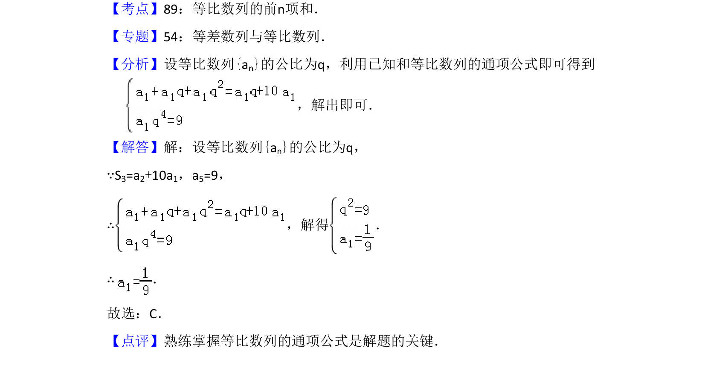

## 题面

## 摘要

该题考查等比数列通项公式与前n项和的基本应用，通过建立方程组求解首项。

## 关联考点

- [[358-等比数列概念|等比数列]]
- [[355-等差数列前n项和|前n项和]]
- [[384-数列通项公式|通项公式]]

## 答案与解析

> 📄 原 PDF 第 2 页：`素材/真题/吉林/2008-2024·（吉林）数学高考真题/2013年高考数学试卷（理）（新课标Ⅱ）（解析卷）.pdf`
