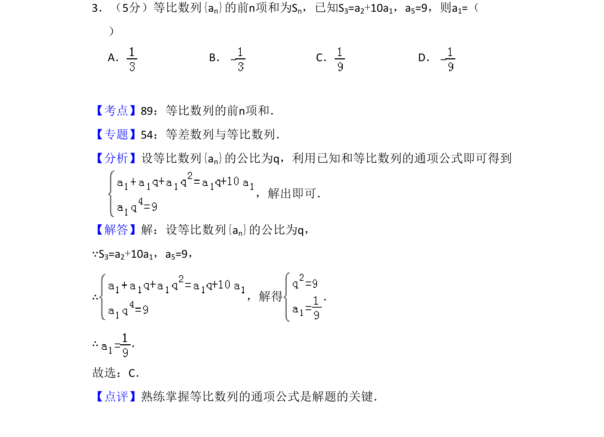
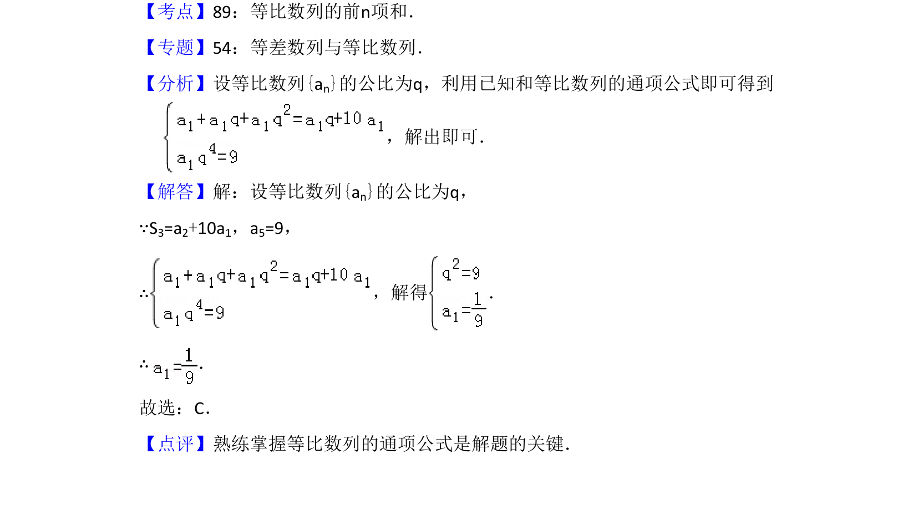

## 题面

## 摘要

该题考查等比数列通项公式与前n项和的基本应用，通过建立方程组求解首项。

## 关联考点

- [[358-等比数列概念|等比数列]]
- [[355-等差数列前n项和|前n项和]]
- [[384-数列通项公式|通项公式]]

## 答案与解析

> 📄 原 PDF 第 2 页：`素材/真题/吉林/2008-2024·（吉林）数学高考真题/2013年高考数学试卷（理）（新课标Ⅱ）（解析卷）.pdf`

<!-- 题干文本-start -->
## 题干文本
3．（5分）等比数列{an}的前n项和为Sn，已知S3=a2+10a1，a5=9，则a1=（　　
）
A．B．C．D．
<!-- 题干文本-end -->

<!-- 解析文本-start -->
## 解析文本
【考点】89：等比数列的前n项和．菁优网版权所有
【专题】54：等差数列与等比数列．
【分析】设等比数列{an}的公比为q，利用已知和等比数列的通项公式即可得到
，解出即可．
【解答】解：设等比数列{an}的公比为q，
∵S3=a2+10a1，a5=9，
∴，解得 ．
∴．
故选：C．
【点评】熟练掌握等比数列的通项公式是解题的关键．
<!-- 解析文本-end -->
