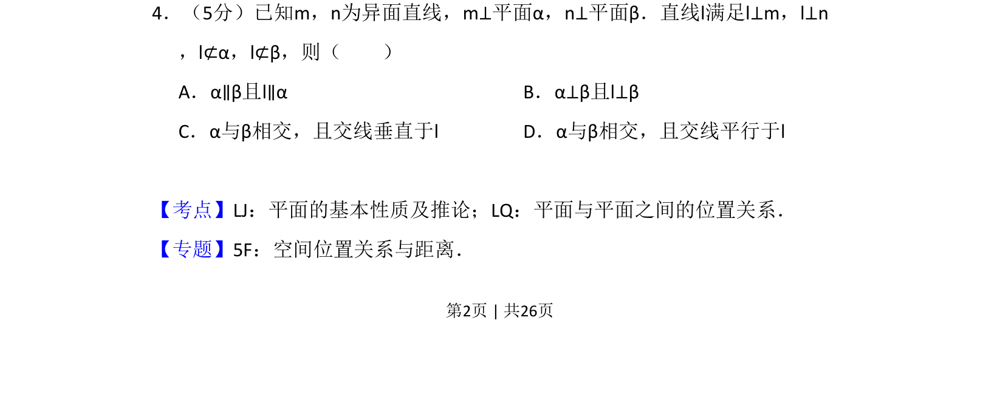

## 题面

## 摘要

已知m,n为异面直线且分别垂直平面α,β，直线l同时垂直m,n且不在平面内，推断面面关系及交线与l的关系。

## 关联考点

- [[异面直线]]
- [[351-空间直线平面垂直|线面垂直]]
- [[面面位置关系]]
- [[交线性质]]

## 答案与解析

> 📄 原 PDF 第 2 页：`素材/真题/吉林/2008-2024·（吉林）数学高考真题/2013年高考数学试卷（理）（新课标Ⅱ）（解析卷）.pdf`
