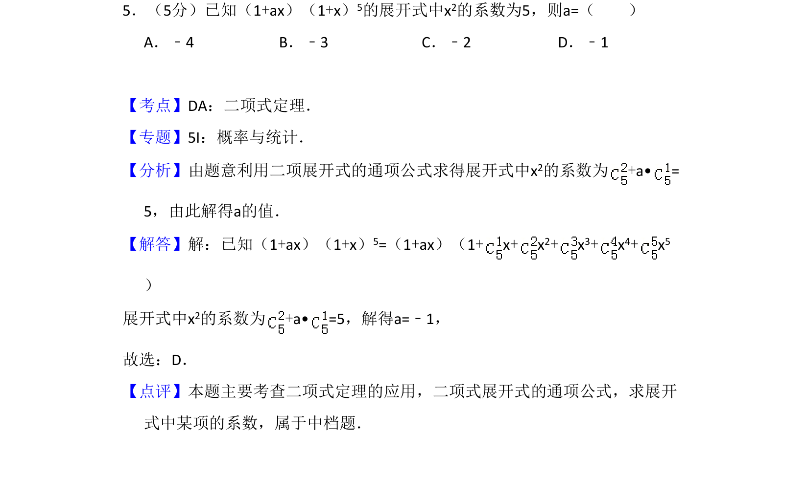
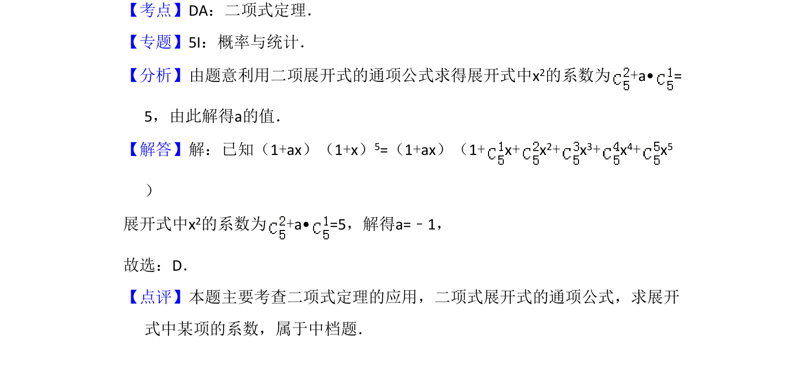

## 题面

## 摘要

该题考查二项式定理展开式中特定项系数的计算，涉及多项式乘法与组合数应用。

## 关联考点

- [[472-二项式定理|二项式定理]]
- [[1160-展开式通项|展开式通项]]
- [[1079-系数求解|系数求解]]

## 答案与解析

> 📄 原 PDF 第 3 页：`素材/真题/吉林/2008-2024·（吉林）数学高考真题/2013年高考数学试卷（理）（新课标Ⅱ）（解析卷）.pdf`

<!-- 题干文本-start -->
## 题干文本
5．（5分）已知（1+ax）（1+x）5的展开式中x2的系数为5，则a=（　　）
A．﹣4 B．﹣3 C．﹣2 D．﹣1
<!-- 题干文本-end -->

<!-- 解析文本-start -->
## 解析文本
【考点】DA：二项式定理．菁优网版权所有
【专题】5I：概率与统计．
【分析】由题意利用二项展开式的通项公式求得展开式中x2的系数为+a• =
5，由此解得a的值．
【解答】解：已知（1+ax）（1+x）5=（1+ax）（1+x+x 2+x 3+x 4+x 5
） 
展开式中x2的系数为+a• =5，解得a=﹣1，
故选：D．
【点评】本题主要考查二项式定理的应用，二项式展开式的通项公式，求展开
式中某项的系数，属于中档题．
<!-- 解析文本-end -->
