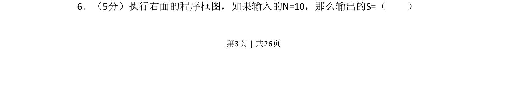
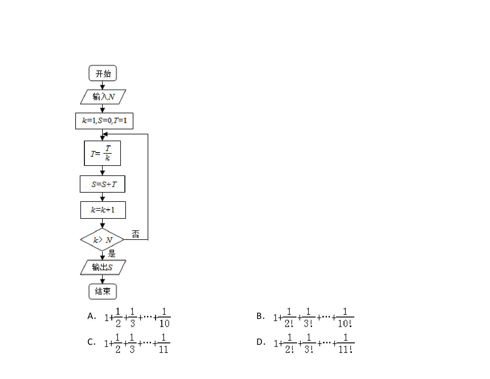
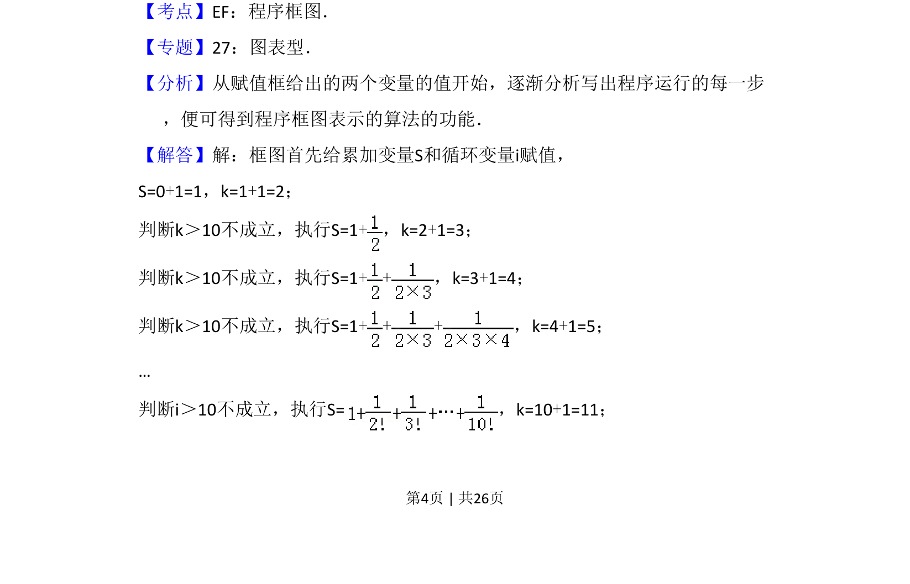
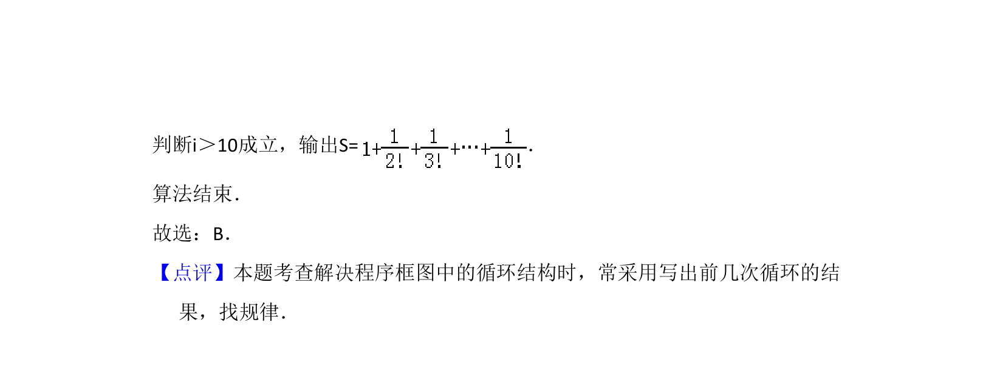

## 题面

## 摘要

执行程序框图，根据输入N=10，通过循环结构计算并输出S的值。

## 关联考点

- [[1042-程序框图|程序框图]]
- [[870-循环结构|循环结构]]
- [[357-等比数列前n项和|等比数列求和]]

## 答案与解析

> 📄 原 PDF 第 3 页：`素材/真题/吉林/2008-2024·（吉林）数学高考真题/2013年高考数学试卷（理）（新课标Ⅱ）（解析卷）.pdf`
