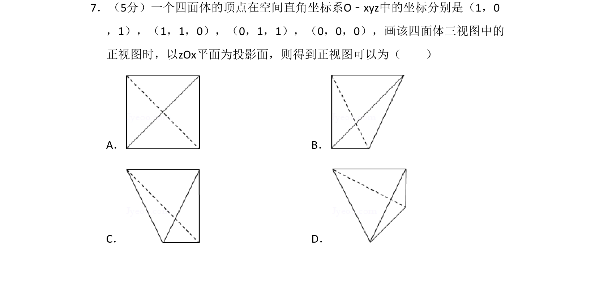
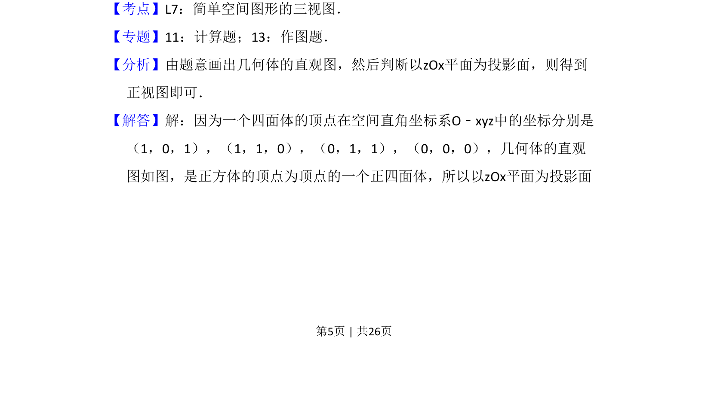
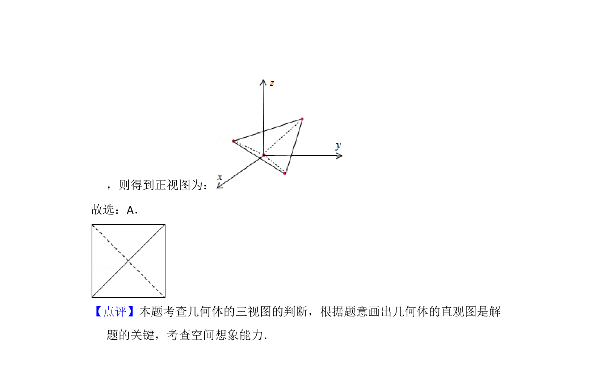

## 题面

## 摘要

在给定坐标系中，由四面体顶点坐标判断以zOx为投影面的正视图形状。

## 关联考点

- [[235-三视图|三视图]]
- [[399-空间向量坐标表示|空间直角坐标系]]
- [[959-正四面体|正四面体]]

## 答案与解析

> 📄 原 PDF 第 5 页：`素材/真题/吉林/2008-2024·（吉林）数学高考真题/2013年高考数学试卷（理）（新课标Ⅱ）（解析卷）.pdf`
