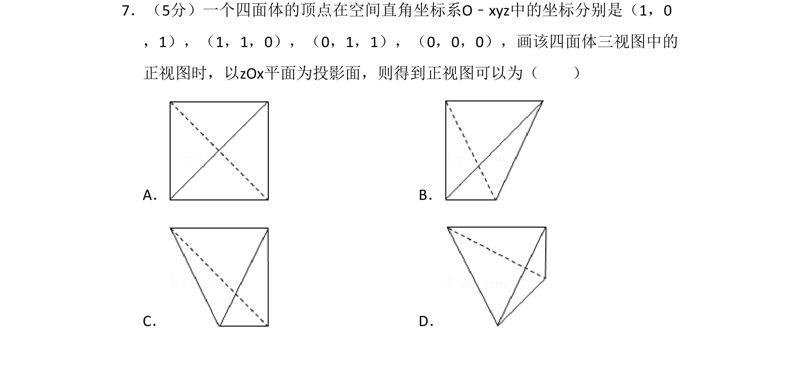
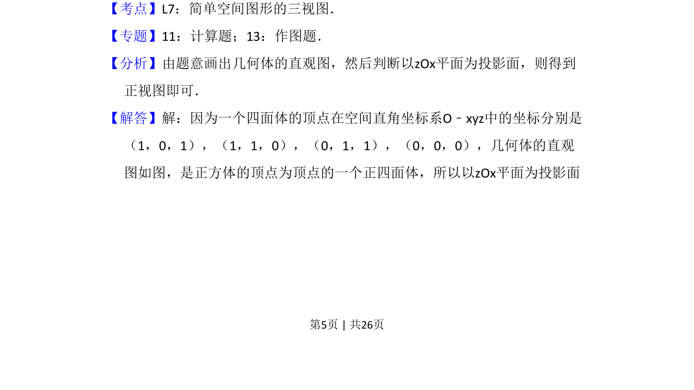
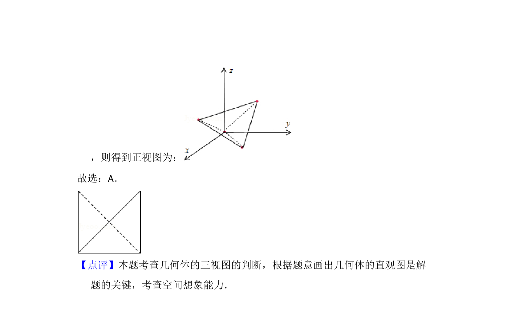

## 题面

## 摘要

在给定坐标系中，由四面体顶点坐标判断以zOx为投影面的正视图形状。

## 关联考点

- [[235-三视图|三视图]]
- [[399-空间向量坐标表示|空间直角坐标系]]
- [[958-正四面体|正四面体]]

## 答案与解析

> 📄 原 PDF 第 5 页：`素材/真题/吉林/2008-2024·（吉林）数学高考真题/2013年高考数学试卷（理）（新课标Ⅱ）（解析卷）.pdf`

<!-- 题干文本-start -->
## 题干文本
7．（5分）一个四面体的顶点在空间直角坐标系O﹣xyz中的坐标分别是（1，0
，1），（1，1，0），（0，1，1），（0，0，0），画该四面体三视图中的
正视图时，以zOx平面为投影面，则得到正视图可以为（　　）
A．B．
C．D．
<!-- 题干文本-end -->

<!-- 解析文本-start -->
## 解析文本
【考点】L7：简单空间图形的三视图．菁优网版权所有
【专题】11：计算题；13：作图题．
【分析】由题意画出几何体的直观图，然后判断以zOx平面为投影面，则得到
正视图即可．
【解答】解：因为一个四面体的顶点在空间直角坐标系O﹣xyz中的坐标分别是
（1，0，1），（1，1，0），（0，1，1），（0，0，0），几何体的直观
图如图，是正方体的顶点为顶点的一个正四面体，所以以zOx平面为投影面
<!-- 解析文本-end -->
