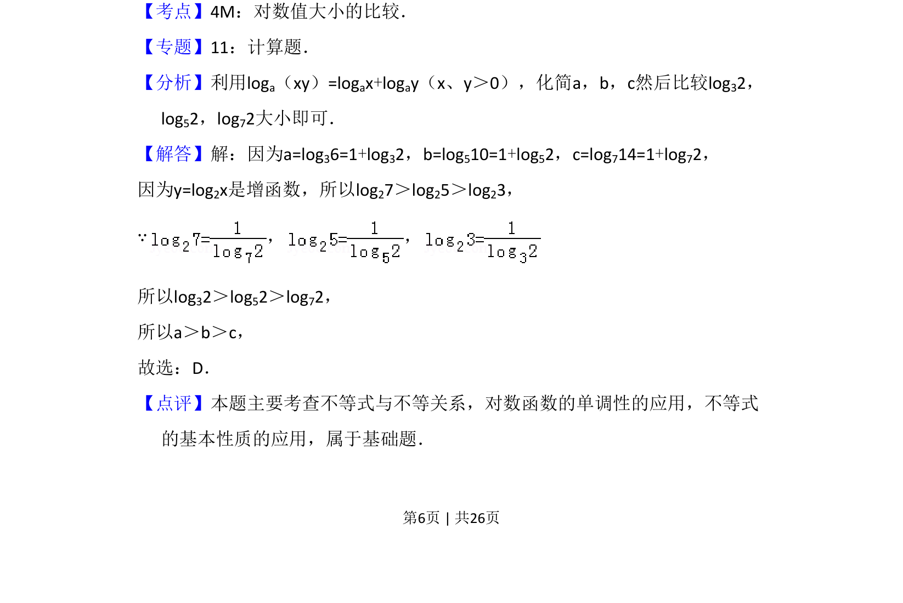

## 题面

## 摘要

通过将a、b、c化为1+logₙ2形式，利用对数函数单调性比较大小。

## 关联考点

- [[对数值大小比较]]
- [[301-对数运算性质|对数运算性质]]
- [[对数函数单调性]]

## 答案与解析

> 📄 原 PDF 第 6 页：`素材/真题/吉林/2008-2024·（吉林）数学高考真题/2013年高考数学试卷（理）（新课标Ⅱ）（解析卷）.pdf`
