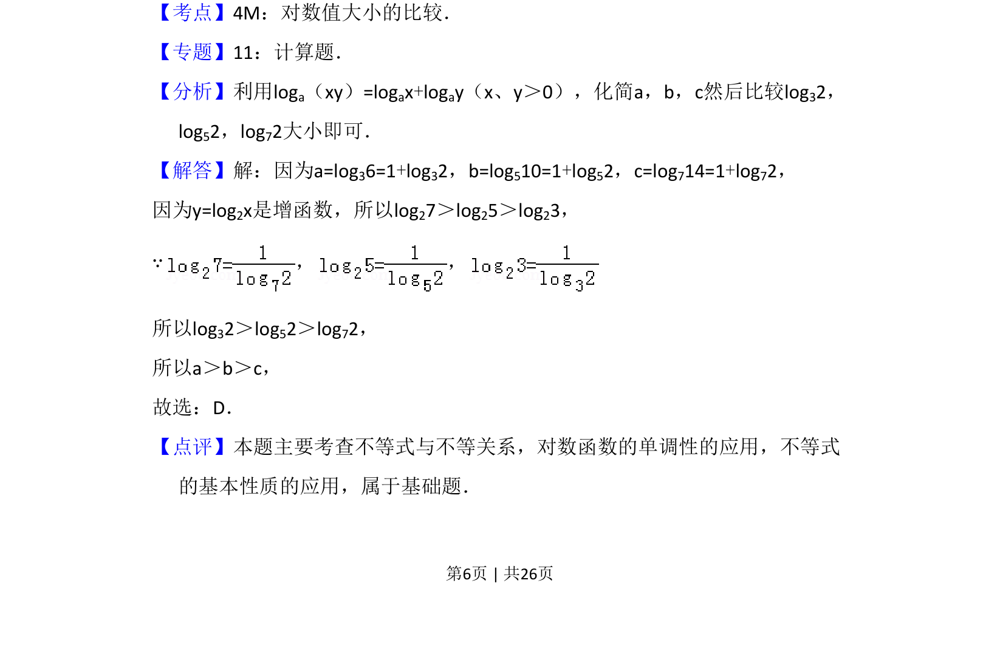

## 题面

## 摘要

通过将a、b、c化为1+logₙ2形式，利用对数函数单调性比较大小。

## 关联考点

- [[1162-对数值大小比较|对数值大小比较]]
- [[301-对数运算性质|对数运算性质]]
- [[827-对数函数单调性|对数函数单调性]]

## 答案与解析

> 📄 原 PDF 第 6 页：`素材/真题/吉林/2008-2024·（吉林）数学高考真题/2013年高考数学试卷（理）（新课标Ⅱ）（解析卷）.pdf`

<!-- 题干文本-start -->
## 题干文本
8．（5分）设a=log36，b=log510，c=log714，则（　　）
A．c＞b＞a B．b＞c＞a C．a＞c＞b D．a＞b＞c
<!-- 题干文本-end -->

<!-- 解析文本-start -->
## 解析文本
【考点】4M：对数值大小的比较．菁优网版权所有
【专题】11：计算题．
【分析】利用loga（xy）=logax+logay（x、y＞0），化简a，b，c然后比较log32，
log52，log72大小即可．
【解答】解：因为a=log36=1+log32，b=log510=1+log52，c=log714=1+log72，
因为y=log2x是增函数，所以log27＞log25＞log23，
∵， ，
所以log32＞log52＞log72，
所以a＞b＞c，
故选：D．
【点评】本题主要考查不等式与不等关系，对数函数的单调性的应用，不等式
的基本性质的应用，属于基础题．
<!-- 解析文本-end -->
