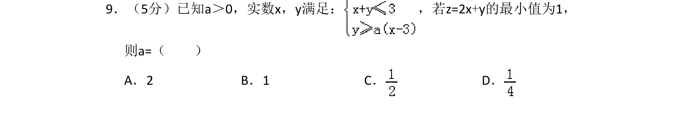
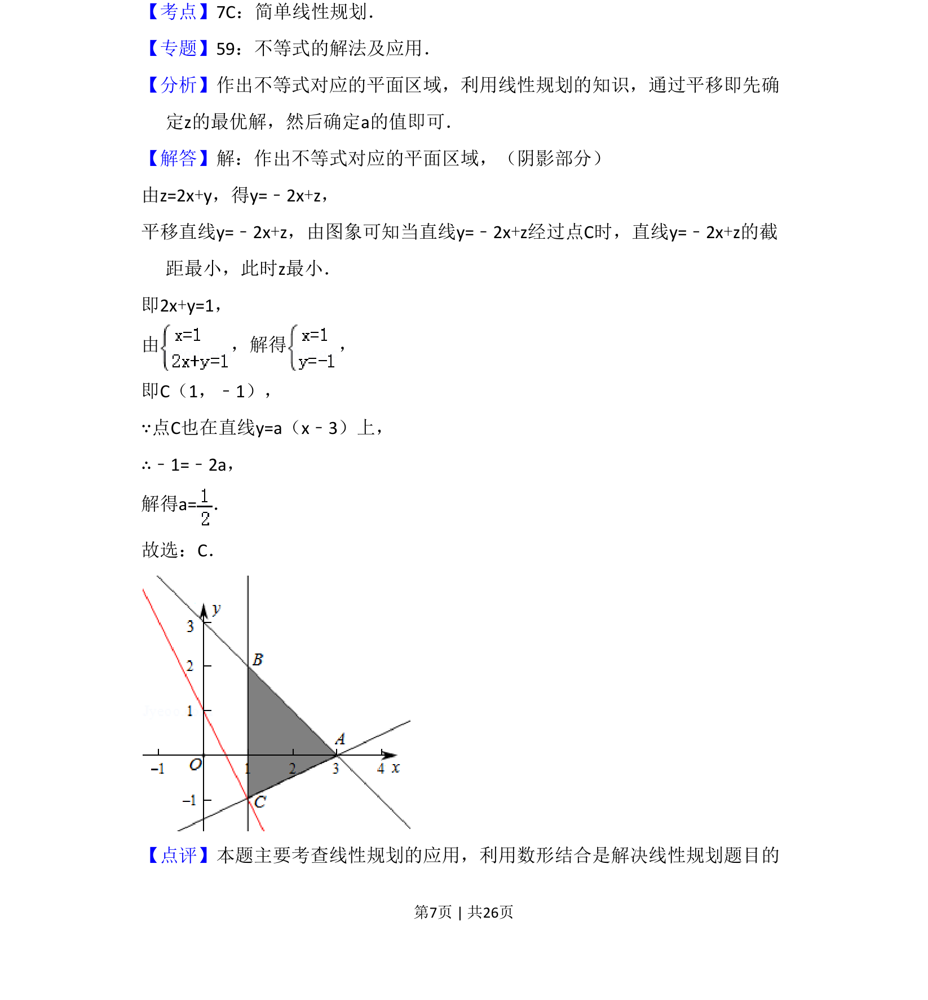

## 题面

## 摘要

通过线性规划求目标函数最小值，结合数形结合思想确定参数a的值。

## 关联考点

- [[1074-简单线性规划|简单线性规划]]
- [[897-数形结合|数形结合]]
- [[912-最优解|最优解]]
- [[725-参数求解|参数求解]]

## 答案与解析

> 📄 原 PDF 第 7 页：`素材/真题/吉林/2008-2024·（吉林）数学高考真题/2013年高考数学试卷（理）（新课标Ⅱ）（解析卷）.pdf`

<!-- 题干文本-start -->
## 题干文本
9．（5分）已知a＞0，实数x，y满足： ，若z=2x+y的最小值为1，
则a=（　　）
A．2 B．1 C．D．
<!-- 题干文本-end -->

<!-- 解析文本-start -->
## 解析文本
【考点】7C：简单线性规划．菁优网版权所有
【专题】59：不等式的解法及应用．
【分析】作出不等式对应的平面区域，利用线性规划的知识，通过平移即先确
定z的最优解，然后确定a的值即可．
【解答】解：作出不等式对应的平面区域，（阴影部分）
由z=2x+y，得y=﹣2x+z，
平移直线y=﹣2x+z，由图象可知当直线y=﹣2x+z经过点C时，直线y=﹣2x+z的截
距最小，此时z最小．
即2x+y=1，
由 ，解得 ，
即C（1，﹣1），
∵点C也在直线y=a（x﹣3）上，
∴﹣1=﹣2a，
解得a=．
故选：C．
【点评】本题主要考查线性规划的应用，利用数形结合是解决线性规划题目的
<!-- 解析文本-end -->
